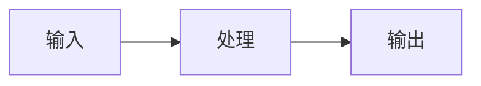

## 功能描述

清晰简洁地描述你想要的功能。

## 问题背景

这个功能解决什么问题？当前有什么痛点？

##  proposed solution

描述你希望的解决方案。

## 替代方案

你考虑过哪些替代方案？为什么不选择它们？

## 设计草图

如果适用，添加设计草图、流程图或架构图。

## 技术方案

- 涉及的模块：[e.g. intelligence, storage, crawler]
- 需要新增的接口：
- 需要修改的接口：
- 性能影响：
- 兼容性影响：

## 验收标准

- [ ] 验收标准 1
- [ ] 验收标准 2
- [ ] 验收标准 3

## 优先级

- [ ] P0 — 紧急，必须立即处理
- [ ] P1 — 高优先级，近期处理
- [ ] P2 — 中优先级，计划处理
- [ ] P3 — 低优先级，有空处理

## 相关 Issue/PR

- Related to #xxx
- Blocked by #xxx
