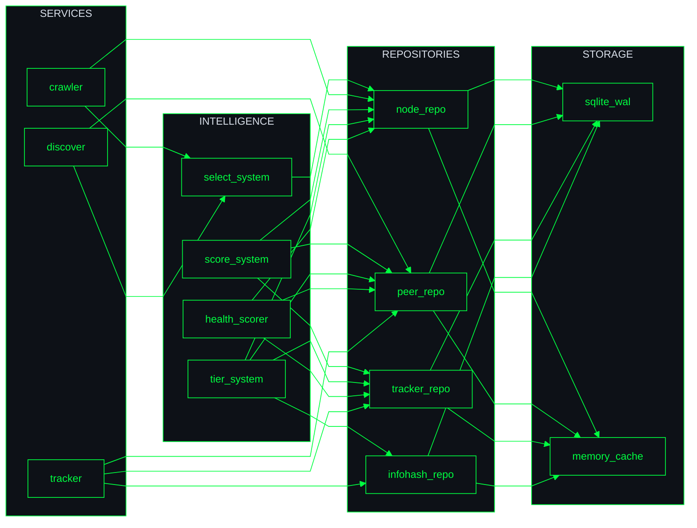

# 00 — 架构总览

> PeerDiscoveryCenter (PDC) — P2P 节点发现中心

## 一句话定位

PDC 是 PandaNetOS 生态中的**节点发现 Agent**，负责通过 DHT、Tracker、PEX、爬虫等多种渠道发现 BT Peer 和 DHT 节点，为下载执行 Agent (spde) 提供高质量的节点资源。

## 核心能力

| 能力 | 说明 | 状态 |
|---|---|---|
| DHT 爬虫 | 主动爬行 DHT 网络，发现节点和 infohash | ✅ |
| Tracker 发现 | 通过 UDP/HTTP Tracker 获取 Peer 列表 | ✅ |
| 超级 Tracker | 内置 Tracker 服务，接收外部 announce | ✅ |
| PEX 节点交换 | Peer Exchange 协议扩展 | ✅ |
| 智能评分 | 节点/Peer/Tracker 多维度质量评分 | ✅ |
| 冷热分层 | 数据温度管理，优化内存与持久化 | ✅ |
| 统一数据层 | 四大 Repo 归口，SQLite 持久化 | ✅ |

## 架构全景

> 四层架构 + 核心数据流，极简黑客风

## 设计原则

### 1. 智能层统一收口
所有智能决策（评分、冷热、选择）统一在 intelligence 层，数据层只负责存储，业务层只负责业务逻辑。

### 2. 数据层唯一真相源
四大 Repo (Node/Peer/Tracker/Infohash) 是所有关键数据的唯一归口，业务模块通过 trait 访问，不绕过 Repo 直接操作底层。

### 3. 增量优先
评分重算、数据持久化等操作优先采用增量方式，避免全量操作带来的性能问题。

### 4. 可观测性
关键操作都有统计和日志，支持监控和问题定位。

## 技术栈

| 类别 | 技术 |
|---|---|
| 语言 | Rust 2021 Edition |
| 异步运行时 | tokio |
| 数据库 | SQLite (rusqlite, WAL 模式) |
| 内存同步 | parking_lot::RwLock |
| 序列化 | serde + bencode |
| 网络 | tokio::net (UDP/TCP) |
| 日志 | tracing |
| 测试 | cargo test |

## 关键指标

| 指标 | 当前值 | 目标 |
|---|---|---|
| DHT 节点数 | 60,000+ | 1,000,000+ |
| Peer 数 | 800+ | 10,000+ |
| Infohash 数 | 90+ | 1,000+ |
| Tracker 数 | 79 | 200+ |
| 评分重算延迟 | 增量 10s | 增量 5s |
| 磁盘 IO | < 1 MB/s | < 0.5 MB/s |

## 下一步

- 阅读 [01-system-context.md](01-system-context.md) 了解系统上下文
- 阅读 [02-container.md](02-container.md) 了解内部模块划分
- 阅读 [03-intelligence.md](03-intelligence.md) 了解智能层设计
