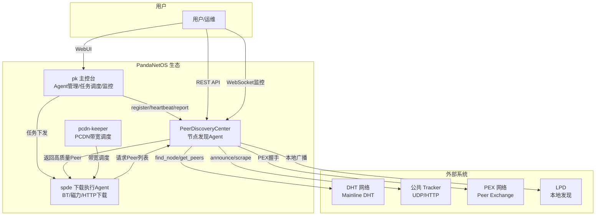
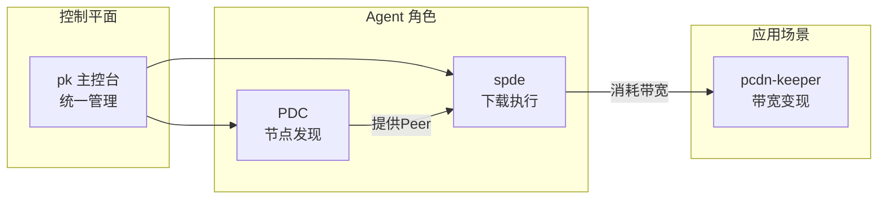
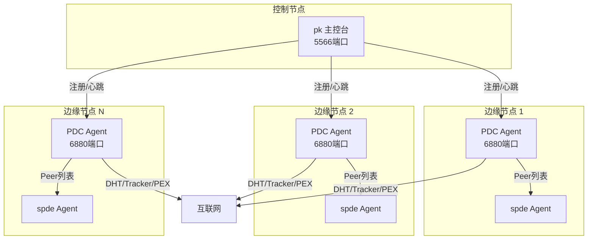

# 01 — 系统上下文 (C4 Level 1)

> PeerDiscoveryCenter 在 PandaNetOS 生态中的位置与外部交互

## 系统上下文图

## 外部依赖

### 上游依赖（PDC 调用）

| 系统 | 协议 | 用途 | 关键操作 |
|---|---|---|---|
| DHT 网络 | UDP / KRPC | 发现 DHT 节点和 infohash | find_node, get_peers, announce_peer |
| 公共 Tracker | UDP / HTTP | 获取指定 infohash 的 Peer 列表 | announce, scrape |
| PEX 网络 | TCP / uTP | Peer 之间交换节点信息 | ut_pex 扩展协议 |
| LPD | UDP 多播 | 本地网络节点发现 | HTTP 多播广播 |

### 下游依赖（调用 PDC）

| 系统 | 接口 | 用途 | 关键操作 |
|---|---|---|---|
| pk 主控台 | HTTP REST | Agent 注册、心跳、状态上报 | register, heartbeat, report |
| spde 下载Agent | HTTP REST | 请求高质量 Peer 列表 | get_peers, get_top_peers |
| 用户/运维 | WebSocket | 实时监控系统状态 | status, stats, health |

## 生态角色定位

**PDC 的定位**：
- ✅ **独立 Agent**：独立进程，通过 register/heartbeat/report 协议接入 pk
- ✅ **数据生产者**：为 spde 提供高质量的 Peer 和 DHT 节点资源
- ❌ **不是应用场景**：不直接参与下载或带宽变现，是基础能力提供者

## 部署拓扑

## 端口规划

| 端口 | 协议 | 用途 |
|---|---|---|
| 6880 | TCP+UDP | 超级 Tracker 服务（announce/scrape） |
| 6882 | UDP | DHT 爬虫端口 |
| 5566 | HTTP | pk 主控台 WebUI（PDC 不占用） |
| 动态 | TCP | PEX 连接（出站） |

## 下一步

- 阅读 [02-container.md](02-container.md) 了解 PDC 内部模块划分
- 阅读 [03-intelligence.md](03-intelligence.md) 了解智能层设计
