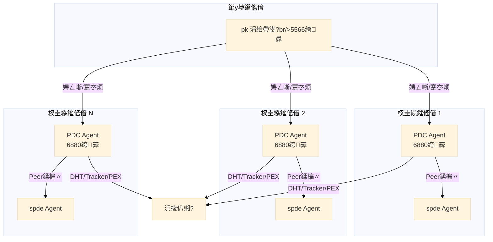

# 01 鈥?绯荤粺涓婁笅鏂?(C4 Level 1)

> PeerDiscoveryCenter 鍦?PandaNetOS 鐢熸€佷腑鐨勪綅缃笌澶栭儴浜や簰

## 绯荤粺涓婁笅鏂囧浘

```mermaid
%%{init: {'theme':'base', 'themeVariables': {'fontSize':'16px'}, 'flowchart': {'nodeSpacing': 50, 'rankSpacing': 80}, 'sequence': {'actorMargin': 50, 'messageMargin': 20}}}%%
graph TB
    subgraph "PandaNetOS 鐢熸€?
        PK[pk 涓绘帶鍙?br/>Agent绠＄悊/浠诲姟璋冨害/鐩戞帶]
        SPDE[spde 涓嬭浇鎵цAgent<br/>BT/纾佸姏/HTTP涓嬭浇]
        PDC[PeerDiscoveryCenter<br/>鑺傜偣鍙戠幇Agent]
        PCDN[pcdn-keeper<br/>PCDN甯﹀璋冨害]
    end

    subgraph "澶栭儴绯荤粺"
        DHT[DHT 缃戠粶<br/>Mainline DHT]
        TRACKER[鍏叡 Tracker<br/>UDP/HTTP]
        PEX[PEX 缃戠粶<br/>Peer Exchange]
        LPD[LPD<br/>鏈湴鍙戠幇]
    end

    subgraph "鐢ㄦ埛"
        USER[鐢ㄦ埛/杩愮淮]
    end

    %% 鐢熸€佸唴閮ㄤ氦浜?
    PK -->|register/heartbeat/report| PDC
    PK -->|浠诲姟涓嬪彂| SPDE
    SPDE -->|璇锋眰Peer鍒楄〃| PDC
    PDC -->|杩斿洖楂樿川閲廝eer| SPDE
    PCDN -->|甯﹀璋冨害| SPDE

    %% 澶栭儴缃戠粶浜や簰
    PDC -->|find_node/get_peers| DHT
    PDC -->|announce/scrape| TRACKER
    PDC -->|PEX鎻℃墜| PEX
    PDC -->|鏈湴骞挎挱| LPD

    %% 鐢ㄦ埛浜や簰
    USER -->|WebUI| PK
    USER -->|REST API| PDC
    USER -->|WebSocket鐩戞帶| PDC
```

## 澶栭儴渚濊禆

### 涓婃父渚濊禆锛圥DC 璋冪敤锛?

| 绯荤粺 | 鍗忚 | 鐢ㄩ€?| 鍏抽敭鎿嶄綔 |
|---|---|---|---|
| DHT 缃戠粶 | UDP / KRPC | 鍙戠幇 DHT 鑺傜偣鍜?infohash | find_node, get_peers, announce_peer |
| 鍏叡 Tracker | UDP / HTTP | 鑾峰彇鎸囧畾 infohash 鐨?Peer 鍒楄〃 | announce, scrape |
| PEX 缃戠粶 | TCP / uTP | Peer 涔嬮棿浜ゆ崲鑺傜偣淇℃伅 | ut_pex 鎵╁睍鍗忚 |
| LPD | UDP 澶氭挱 | 鏈湴缃戠粶鑺傜偣鍙戠幇 | HTTP 澶氭挱骞挎挱 |

### 涓嬫父渚濊禆锛堣皟鐢?PDC锛?

| 绯荤粺 | 鎺ュ彛 | 鐢ㄩ€?| 鍏抽敭鎿嶄綔 |
|---|---|---|---|
| pk 涓绘帶鍙?| HTTP REST | Agent 娉ㄥ唽銆佸績璺炽€佺姸鎬佷笂鎶?| register, heartbeat, report |
| spde 涓嬭浇Agent | HTTP REST | 璇锋眰楂樿川閲?Peer 鍒楄〃 | get_peers, get_top_peers |
| 鐢ㄦ埛/杩愮淮 | WebSocket | 瀹炴椂鐩戞帶绯荤粺鐘舵€?| status, stats, health |

## 鐢熸€佽鑹插畾浣?

```mermaid
%%{init: {'theme':'base', 'themeVariables': {'fontSize':'16px'}, 'flowchart': {'nodeSpacing': 50, 'rankSpacing': 80}, 'sequence': {'actorMargin': 50, 'messageMargin': 20}}}%%
graph LR
    subgraph "Agent 瑙掕壊"
        A1[spde<br/>涓嬭浇鎵ц]
        A2[PDC<br/>鑺傜偣鍙戠幇]
    end

    subgraph "搴旂敤鍦烘櫙"
        B1[pcdn-keeper<br/>甯﹀鍙樼幇]
    end

    subgraph "鎺у埗骞抽潰"
        C1[pk 涓绘帶鍙?br/>缁熶竴绠＄悊]
    end

    C1 --> A1 & A2
    A2 -->|鎻愪緵Peer| A1
    A1 -->|娑堣€楀甫瀹絴 B1
```

**PDC 鐨勫畾浣?*锛?
- 鉁?**鐙珛 Agent**锛氱嫭绔嬭繘绋嬶紝閫氳繃 register/heartbeat/report 鍗忚鎺ュ叆 pk
- 鉁?**鏁版嵁鐢熶骇鑰?*锛氫负 spde 鎻愪緵楂樿川閲忕殑 Peer 鍜?DHT 鑺傜偣璧勬簮
- 鉂?**涓嶆槸搴旂敤鍦烘櫙**锛氫笉鐩存帴鍙備笌涓嬭浇鎴栧甫瀹藉彉鐜帮紝鏄熀纭€鑳藉姏鎻愪緵鑰?

## 閮ㄧ讲鎷撴墤



## 绔彛瑙勫垝

| 绔彛 | 鍗忚 | 鐢ㄩ€?|
|---|---|---|
| 6880 | TCP+UDP | 瓒呯骇 Tracker 鏈嶅姟锛坅nnounce/scrape锛?|
| 6882 | UDP | DHT 鐖櫕绔彛 |
| 5566 | HTTP | pk 涓绘帶鍙?WebUI锛圥DC 涓嶅崰鐢級 |
| 鍔ㄦ€?| TCP | PEX 杩炴帴锛堝嚭绔欙級 |

## 涓嬩竴姝?

- 闃呰 [02-container.md](02-container.md) 浜嗚В PDC 鍐呴儴妯″潡鍒掑垎
- 闃呰 [03-intelligence.md](03-intelligence.md) 浜嗚В鏅鸿兘灞傝璁?
