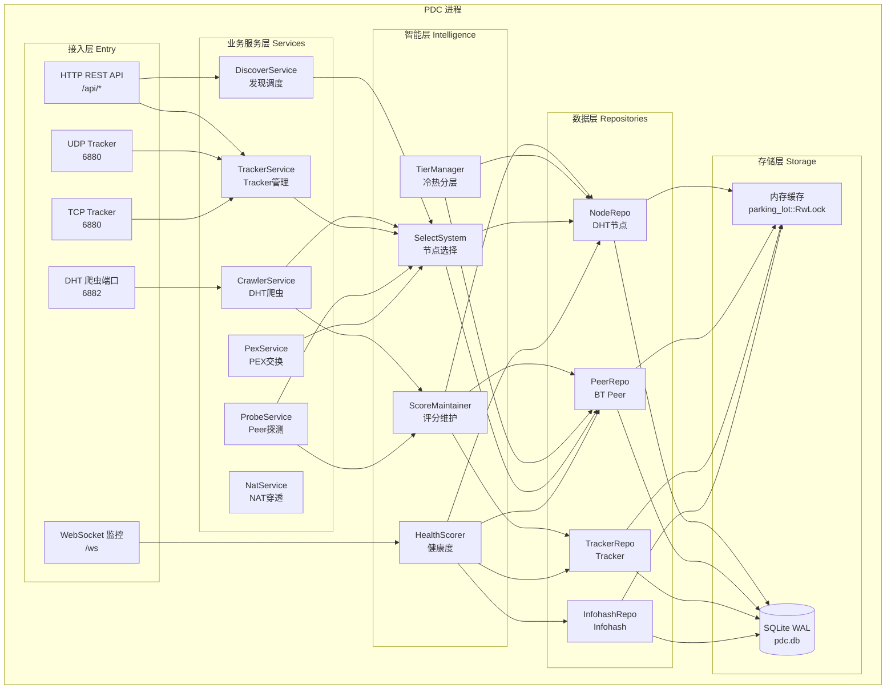

# 02 — 容器图 (C4 Level 2)

> PeerDiscoveryCenter 内部模块划分与通信关系

## 容器图



## 模块职责

### 接入层 (Entry)

| 模块 | 职责 | 关键接口 |
|---|---|---|
| HTTP REST API | 对外提供 REST 接口 | /api/nodes, /api/peers, /api/trackers, /api/health |
| WebSocket 监控 | 实时状态推送 | /ws（status, stats, health 事件） |
| UDP Tracker | BEP 15 UDP Tracker 协议 | announce, scrape |
| TCP Tracker | HTTP Tracker 协议 | /announce, /scrape |
| DHT 爬虫端口 | DHT KRPC 协议 | find_node, get_peers, announce_peer |

### 业务服务层 (Services)

| 模块 | 职责 | 关键操作 |
|---|---|---|
| DiscoverService | 统一发现调度，协调各发现渠道 | discover(infohash), get_peers(infohash) |
| CrawlerService | DHT 网络主动爬行 | crawl(), select_diverse_nodes(), chain_crawl() |
| TrackerService | Tracker 池管理与请求 | add_tracker(), announce(), scrape() |
| ProbeService | Peer 可达性探测 | probe_peer(), update_probe_stats() |
| PexService | Peer Exchange 协议 | pex_handshake(), exchange_peers() |
| NatService | NAT 穿透与端口映射 | upnp_map(), nat_pmp_map() |

### 智能层 (Intelligence)

| 模块 | 职责 | 关键操作 |
|---|---|---|
| ScoreMaintainer | 统一评分维护，增量+全量双模式 | rescore_incremental(), rescore_all() |
| TierManager | 冷热分层管理，温度迁移 | check_and_migrate(), tier_stats() |
| SelectSystem | 统一节点选择 | select_diverse_nodes(), select_top_nodes() |
| HealthScorer | 系统健康度评估 | calculate() → HealthReport |

### 数据层 (Repositories)

| Repo | 职责 | 数据规模 | 持久化 |
|---|---|---|---|
| NodeRepo | DHT 节点存储与评分 | 60,000+ | SQLite dht_nodes 表 |
| PeerRepo | BT Peer 存储（按 infohash 分组） | 800+ | SQLite peers 表 |
| TrackerRepo | Tracker 池存储与评分 | 79 | SQLite trackers 表 |
| InfohashRepo | Infohash 注册与引用计数 | 90+ | SQLite infohashes 表 |

## 通信关系

### 同步调用（直接函数调用）

```
业务层 → 智能层 → 数据层 → 存储层
```

所有层在同一进程内，通过 trait 对象直接调用，无网络开销。

### 异步任务（tokio::spawn）

| 任务 | 间隔 | 说明 |
|---|---|---|
| 评分增量重算 | 10s | ScoreMaintainer 重算脏节点 |
| 评分全量重算 | 300s | ScoreMaintainer 兜底全量重算 |
| 冷热分层检查 | 300s | TierManager 检查温度迁移 |
| 数据持久化 | 300s | 各 Repo 全量保存到 SQLite |
| peer_history flush | 30s | 批量写入历史记录 |
| WAL checkpoint | 600s | SQLite WAL 合并到主库 |
| 健康检查 | 300s | 系统健康度评估与统计 |

### 事件驱动

- DHT 响应到达 → 触发节点添加 + 脏标记 + 链式爬行
- Tracker 响应到达 → 触发 Peer 添加 + 统计更新
- Probe 完成 → 触发 Peer 探测统计更新 + 脏标记

## 数据流

### DHT 爬虫数据流

```
DHT响应 → CrawlerService → NodeRepo.add_node()
                              → NodeRepo.mark_dirty()
                              → SelectSystem.select_diverse_nodes()
                              → 链式爬行
ScoreMaintainer(10s) → NodeRepo.dirty_nodes() → 计算评分 → update_scores_batch()
```

### Tracker 发现数据流

```
Tracker响应 → TrackerService → PeerRepo.add_peers()
                                → TrackerRepo.record_request()
                                → InfohashRepo.register()
ScoreMaintainer(300s) → 全量重算 Tracker/Peer 评分
```

## 下一步

- 阅读 [03-intelligence.md](03-intelligence.md) 了解智能层详细设计
- 阅读 [04-data-model.md](04-data-model.md) 了解数据模型
