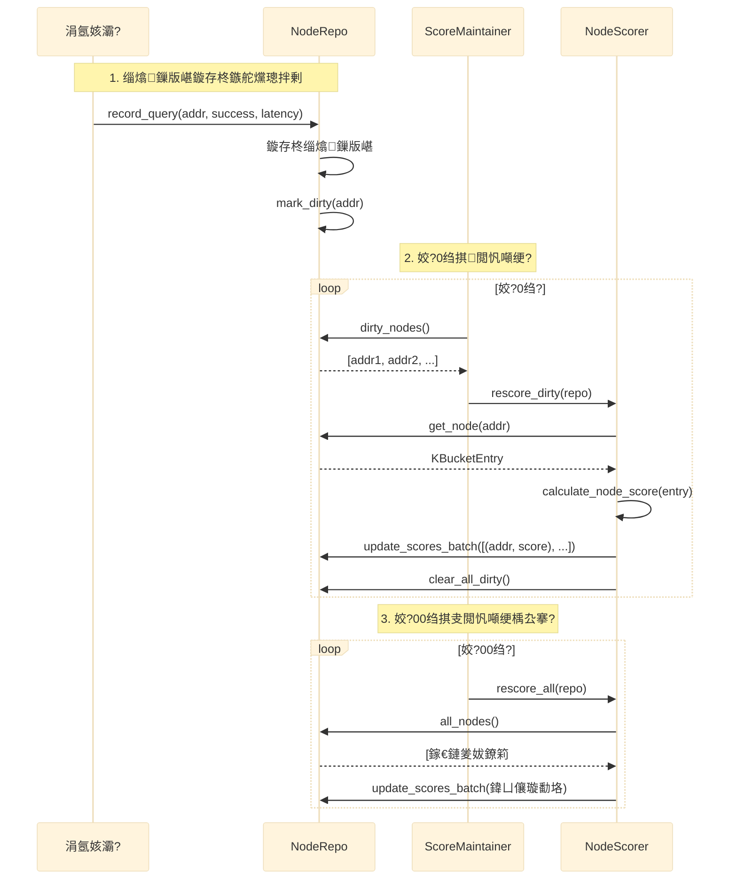

# 03 鈥?鏅鸿兘灞傝缁嗚璁?(C4 Level 3)

> Intelligence 灞?鈥?璇勫垎绯荤粺銆佸喎鐑垎灞傘€佽妭鐐归€夋嫨鐨勭粺涓€鏀跺彛

## 璁捐鍘熷垯

### 缁熶竴鏀跺彛
鎵€鏈夋櫤鑳藉喅绛栵紙璇勫垎銆佸喎鐑€侀€夋嫨锛夌粺涓€鍦?intelligence 灞傦細
- **鏁版嵁灞?(Repo)**锛氬彧璐熻矗鏁版嵁瀛樺偍鍜屾煡璇紝涓嶅仛鏅鸿兘鍒ゆ柇
- **涓氬姟灞?(Services)**锛氬彧璐熻矗涓氬姟閫昏緫锛岄€氳繃 intelligence 灞傝幏鍙栬瘎鍒嗗拰鍐风儹鍒ゆ柇
- **鏅鸿兘灞?(Intelligence)**锛氬敮涓€鐨勬櫤鑳藉喅绛栧叆鍙?

### 澧為噺浼樺厛
璇勫垎閲嶇畻銆佹暟鎹寔涔呭寲绛夋搷浣滀紭鍏堥噰鐢ㄥ閲忔柟寮忥紝閬垮厤鍏ㄩ噺鎿嶄綔甯︽潵鐨勬€ц兘闂銆?

### 鍙娴嬫€?
鍏抽敭鎿嶄綔閮芥湁缁熻鍜屾棩蹇楋紝鏀寔鐩戞帶鍜岄棶棰樺畾浣嶃€?

## 瀛愮郴缁熷垝鍒?

```mermaid
%%{init: {'theme':'base', 'themeVariables': {'fontSize':'16px'}, 'flowchart': {'nodeSpacing': 50, 'rankSpacing': 80}, 'sequence': {'actorMargin': 50, 'messageMargin': 20}}}%%
graph TB
    subgraph "Intelligence 灞?
        ORCH[Intelligence 璋冨害<br/>瀹氭椂浠诲姟绠＄悊]

        subgraph "ScoreSystem 璇勫垎绯荤粺"
            SM[ScoreMaintainer<br/>缁熶竴缁存姢]
            NS[NodeScorer<br/>DHT鑺傜偣璇勫垎]
            PS[PeerScorer<br/>BT Peer璇勫垎]
            TS[TrackerScorer<br/>Tracker璇勫垎]
            HS[HealthScorer<br/>绯荤粺鍋ュ悍搴
        end

        subgraph "TierSystem 鍐风儹鍒嗗眰"
            TM[TierManager<br/>缁熶竴璋冨害]
            NTM[NodeTierManager<br/>鑺傜偣鍒嗗眰]
            PTM[PeerTierManager<br/>Peer鍒嗗眰]
        end

        subgraph "SelectSystem 鑺傜偣閫夋嫨"
            SS[SelectSystem<br/>缁熶竴閫夋嫨]
        end

        subgraph "閰嶇疆"
            CFG[ScorerConfig<br/>鍙厤缃潈閲峕
        end
    end

    ORCH --> SM & TM
    SM --> NS & PS & TS
    TM --> NTM & PTM
    CFG --> NS & PS & TS
```

## ScoreSystem 璇勫垎绯荤粺

### 鏋舵瀯



### 璇勫垎缁村害

#### NodeScorer 鈥?DHT 鑺傜偣璇勫垎锛?缁村害鍔犳潈锛?

| 缁村害 | 鏉冮噸 | 璇存槑 |
|---|---|---|
| 鍝嶅簲鐜?| 40% | success_count / query_count |
| 寤惰繜 | 20% | 骞冲潎鍝嶅簲鏃堕棿锛岃秺蹇秺楂?|
| 鑺傜偣浜у嚭 | 25% | 姣忔鏌ヨ骞冲潎杩斿洖鐨勮妭鐐规暟 |
| 鍦ㄧ嚎鐜?| 15% | 鍩轰簬杩炵画澶辫触娆℃暟 |

**鐗规畩瑙勫垯**锛?
- Bad 鐘舵€佺洿鎺?0 鍒?
- Questionable 鐘舵€佹儵缃氾細璇勫垎 脳 0.7
- 鏃堕棿琛板噺锛氭渶鍚庢煡璇㈣秴杩?24 灏忔椂锛岃瘎鍒嗘寜鏃堕棿琛板噺锛堟渶浣?0.5锛?

#### PeerScorer 鈥?BT Peer 璇勫垎锛?缁村害鍔犳潈锛?

| 缁村害 | 鏉冮噸 | 璇存槑 |
|---|---|---|
| 鏉ユ簮鍙俊搴?| 30% | Tracker > SuperTracker > LPD > WebSeed > DHT > PEX > Manual |
| TCP 鍙揪鎬?| 30% | connection_successes / connection_attempts |
| DHT 鏀寔 | 20% | 鏄惁鏀寔 DHT 鍗忚 |
| 瀛樻椿鏃堕棿 | 10% | first_seen 鍒扮幇鍦ㄧ殑鏃堕棿 |
| 澶?infohash 鍏变韩 | 10% | 鍑虹幇鍦ㄥ灏戜釜 infohash 涓?|

#### TrackerScorer 鈥?Tracker 璇勫垎锛?缁村害鍔犳潈锛?

| 缁村害 | 鏉冮噸 | 璇存槑 |
|---|---|---|
| 鎴愬姛鐜?| 40% | success_requests / total_requests |
| 鍝嶅簲閫熷害 | 20% | 骞冲潎鍝嶅簲鏃堕棿 |
| Peer 浜у嚭 | 25% | 姣忔璇锋眰骞冲潎鍙戠幇鐨?Peer 鏁?|
| 鍦ㄧ嚎鐜?| 15% | 鍩轰簬杩炵画澶辫触娆℃暟 |

**鐗规畩瑙勫垯**锛歞isabled 鐩存帴 0 鍒?

### 澧為噺璇勫垎鏈哄埗

#### 鑴忔爣璁?(Dirty Flag)

```rust
// NodeRepository trait 鏂板鏂规硶
async fn mark_dirty(&self, addr: &SocketAddr);
async fn dirty_nodes(&self) -> Vec<SocketAddr>;
async fn clear_dirty(&self, addr: &SocketAddr);
async fn clear_all_dirty(&self);
```

**瑙﹀彂鑴忔爣璁扮殑鏃舵満**锛?
- `record_query()` 鈥?鑺傜偣鏌ヨ缁熻鏇存柊
- `record_query_with_nodes()` 鈥?鑺傜偣鏌ヨ+浜у嚭缁熻鏇存柊
- `set_node_state()` 鈥?鑺傜偣鐘舵€佸彉鍖?

#### 鎵归噺鏇存柊

```rust
// NodeRepository trait 鏂板鏂规硶
async fn update_scores_batch(&self, scores: &[(SocketAddr, f64)]);
```

**浼樺娍**锛?
- 涓€娆″啓閿侊紝閬垮厤 60000 娆￠攣绔炰簤
- 涓€娆′簨鍔★紝閬垮厤 60000 娆?SQLite UPDATE
- 鎬ц兘鎻愬崌锛氫粠 O(n) 娆￠攣+浜嬪姟 鈫?O(1) 娆￠攣+浜嬪姟

### 鍙厤缃潈閲?

```rust
pub struct ScorerConfig {
    pub node: NodeScoreConfig,
    pub peer: PeerScoreConfig,
    pub tracker: TrackerScoreConfig,
}

pub struct NodeScoreConfig {
    pub response_rate_weight: f64,    // 榛樿 40.0
    pub latency_weight: f64,           // 榛樿 20.0
    pub nodes_output_weight: f64,      // 榛樿 25.0
    pub uptime_weight: f64,            // 榛樿 15.0
    pub questionable_penalty: f64,     // 榛樿 0.7
    pub decay_start_hours: f64,        // 榛樿 24.0
    pub decay_end_hours: f64,          // 榛樿 168.0
    pub decay_min_factor: f64,         // 榛樿 0.5
}
```

**浣跨敤鏂瑰紡**锛?
```rust
let scorer = NodeScorerImpl::with_config(NodeScoreConfig {
    response_rate_weight: 50.0,
    ..Default::default()
});
```

## TierSystem 鍐风儹鍒嗗眰

### 澶氱淮搴﹀垽瀹?

| 缁村害 | 鏉冮噸 | 璇存槑 |
|---|---|---|
| 鏈€鍚庢椿璺冩椂闂?| 40% | 鏈€杩戞椿璺冪殑鏇村彲鑳借鍐嶆璁块棶 |
| 鑺傜偣璇勫垎 | 30% | 楂樿瘎鍒嗚妭鐐规洿鍙兘琚埇铏€夋嫨 |
| 璁块棶棰戠巼 | 20% | query_count 楂樼殑鑺傜偣鏇存椿璺?|
| 鏁版嵁閲嶈鎬?| 10% | 棰勭暀鎵╁睍锛堝鐑棬 infohash 鐨?peer锛?|

### 鐗规畩瑙勫垯

#### 楂樿瘎鍒嗕繚搴?
璇勫垎 > 70 鐨勮妭鐐癸紝鍗充娇鏆傛椂涓嶆椿璺冧篃鑷冲皯淇濈暀涓?*娓╂暟鎹?*锛岄伩鍏嶄紭璐ㄨ妭鐐硅璇檷绾с€?

#### 浣庤瘎鍒嗗姞閫熼檷绾?
璇勫垎 < 30 鐨勮妭鐐癸紝鐑槇鍊肩缉鐭负 1/3锛屽姞閫熼檷绾т互閲婃斁鍐呭瓨銆?

#### 璁块棶棰戠巼璋冩暣
- 楂橀璁块棶锛?100娆★級锛氱儹闃堝€煎欢闀?1.5 鍊?
- 浣庨璁块棶锛?5娆★級锛氱儹闃堝€肩缉鐭负 1/2

### 灞傜骇瀹氫箟

| 灞傜骇 | 璇存槑 | 瀛樺偍绛栫暐 |
|---|---|---|
| Hot锛堢儹锛?| 鏈€杩戞椿璺?+ 楂樿瘎鍒?+ 楂橀璁块棶 | 鍐呭瓨甯搁┗锛屼紭鍏堣闂?|
| Warm锛堟俯锛?| 鏈夋椿璺冧絾棰戠巼涓嶉珮锛屾垨楂樿瘎鍒嗕絾鏆傛椂涓嶆椿璺?| 閮ㄥ垎鍦ㄥ唴瀛橈紝鍙粠纾佺洏鍔犺浇 |
| Cold锛堝喎锛?| 闀挎椂闂存棤娲昏穬锛屼綆璇勫垎 | 纾佺洏褰掓。锛屽彲浠庡唴瀛樻竻鐞?|

### TierSystem 鎺ュ彛

```rust
impl TierSystem {
    pub fn classify_node(last_active, score, query_count) -> DataTier;
    pub fn should_persist(last_active, score, query_count) -> bool;
    pub fn should_keep_in_memory(last_active, score, query_count) -> bool;
    pub async fn check_node_repo(repo) -> TierStats;
    pub async fn get_hot_nodes(repo) -> Vec<SocketAddr>;
    pub async fn get_persistable_nodes(repo) -> Vec<SocketAddr>;
}
```

## SelectSystem 鑺傜偣閫夋嫨

### 缁熶竴閫夋嫨鎺ュ彛

```rust
impl SelectSystem {
    /// 澶氭牱鎬ч€夋嫨锛堢埇铏敤锛?
    pub fn select_diverse_nodes(repo, count, max_per_subnet) -> Vec<KBucketEntry>;

    /// 鎸夎瘎鍒嗛€?Top N
    pub fn select_top_nodes(repo, n) -> Vec<KBucketEntry>;

    /// 鐖櫕鍊欓€夐€夋嫨锛堢儹鑺傜偣浼樺厛 + 楂樿瘎鍒?+ 澶氭牱鎬э級
    pub fn select_crawl_candidates(repo, count, max_per_subnet) -> Vec<KBucketEntry>;
}
```

### 澶氭牱鎬ч€夋嫨绠楁硶

```mermaid
%%{init: {'theme':'base', 'themeVariables': {'fontSize':'16px'}, 'flowchart': {'nodeSpacing': 50, 'rankSpacing': 80}, 'sequence': {'actorMargin': 50, 'messageMargin': 20}}}%%
graph LR
    A[鍙?Top 500 鍊欓€?br/>鎸夎瘎鍒嗛檷搴廬 --> B[鎸?ID 楂?浣嶅垎16妗禲
    B --> C[杞鍚勬《閫夊彇]
    C --> D{IP /24 鍘婚噸妫€鏌
    D -->|鏈揪涓婇檺| E[閫変腑璇ヨ妭鐐筣
    D -->|宸茶揪涓婇檺| F[璺宠繃锛岀户缁笅涓€涓猐
    E --> G{閫夋弧 count?}
    F --> G
    G -->|鏄瘄 H[杩斿洖缁撴灉]
    G -->|鍚 C
```

### 鎬ц兘浼樺寲

**涔嬪墠**锛?
- 璋冪敤 `repo.all_nodes_sync()` 鍏ㄩ噺鍏嬮殕 60000+ 鑺傜偣
- 姣忔閫夋嫨閮藉垎閰?60000+ 涓?KBucketEntry 鐨勫唴瀛?

**鐜板湪**锛?
- 璋冪敤 `repo.top_nodes_sync(500)` 鍙彇 Top 500
- 鍙湪鏈€鍚庤繑鍥為€変腑鑺傜偣鏃跺厠闅?
- 鍐呭瓨鍒嗛厤浠?60000+ 鈫?500

## HealthScorer 鍋ュ悍搴?

### 涓夊眰鍔犳潈

| 灞傜骇 | 鏉冮噸 | 璇存槑 |
|---|---|---|
| Tracker 灞?| 40% | 娲昏穬姣斾緥 + 骞冲潎璇勫垎 |
| DHT 灞?| 30% | 鑺傜偣涓板瘜搴?+ 骞冲潎璐ㄩ噺 + 娲昏穬姣斾緥 |
| Peer 灞?| 30% | infohash 瑕嗙洊搴?+ peer 涓板瘜搴?|

### 鎬ц兘浼樺寲

**涔嬪墠**锛氭瘡娆¤绠楄皟鐢?`nodes.all_nodes()` 鍏ㄩ噺鍏嬮殕 60000+ 鑺傜偣

**鐜板湪**锛氳皟鐢?`nodes.stats()` 閬嶅巻寮曠敤缁熻锛岄浂鍏嬮殕

```rust
pub struct NodeStats {
    pub total: usize,
    pub good: usize,
    pub questionable: usize,
    pub bad: usize,
    pub active: usize,
    pub avg_score: f64,
}
```

## 鍗冧竾绾ц妭鐐瑰簲瀵圭瓥鐣?

### 璇勫垎绯荤粺
- **澧為噺閲嶇畻**锛氬彧閲嶇畻鑴忚妭鐐癸紝閫氬父 < 1000 涓?杞?
- **鎵归噺鏇存柊**锛氫竴娆′簨鍔℃洿鏂版墍鏈夎瘎鍒?
- **鍒嗙墖骞惰**锛氳剰鑺傜偣鍙垎鎴愬涓垎鐗囧苟琛岃绠楋紙鏈潵浼樺寲锛?
- **闄愭祦**锛氭瘡杞渶澶氶噸绠?X 涓妭鐐癸紝閬垮厤 CPU 鍗犳弧锛堟湭鏉ヤ紭鍖栵級

### 鍐风儹鍒嗗眰
- **鐑妭鐐?*锛? 5000锛屽叏閲忛珮棰戦噸绠?
- **娓╄妭鐐?*锛?000-50000锛屽閲忛噸绠楄剰鑺傜偣
- **鍐疯妭鐐?*锛? 50000锛屼笉閲嶇畻锛堣瘎鍒嗗凡绋冲畾锛?

### 鑺傜偣閫夋嫨
- **Top N 鍊欓€?*锛氬彧鍙栬瘎鍒嗘渶楂樼殑 500 涓綔涓哄€欓€夋睜
- **涓嶅叏閲忓厠闅?*锛氶亶鍘嗗紩鐢紝鍙湪鏈€鍚庤繑鍥炴椂鍏嬮殕

## 涓嬩竴姝?

- 闃呰 [04-data-model.md](04-data-model.md) 浜嗚В鏁版嵁妯″瀷
- 闃呰 [05-runtime-flow.md](05-runtime-flow.md) 浜嗚В杩愯鏃舵祦绋?
