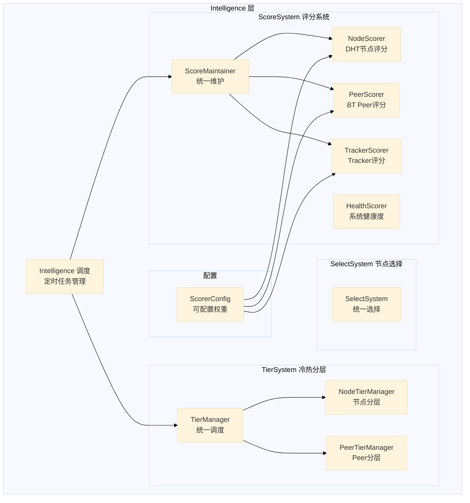
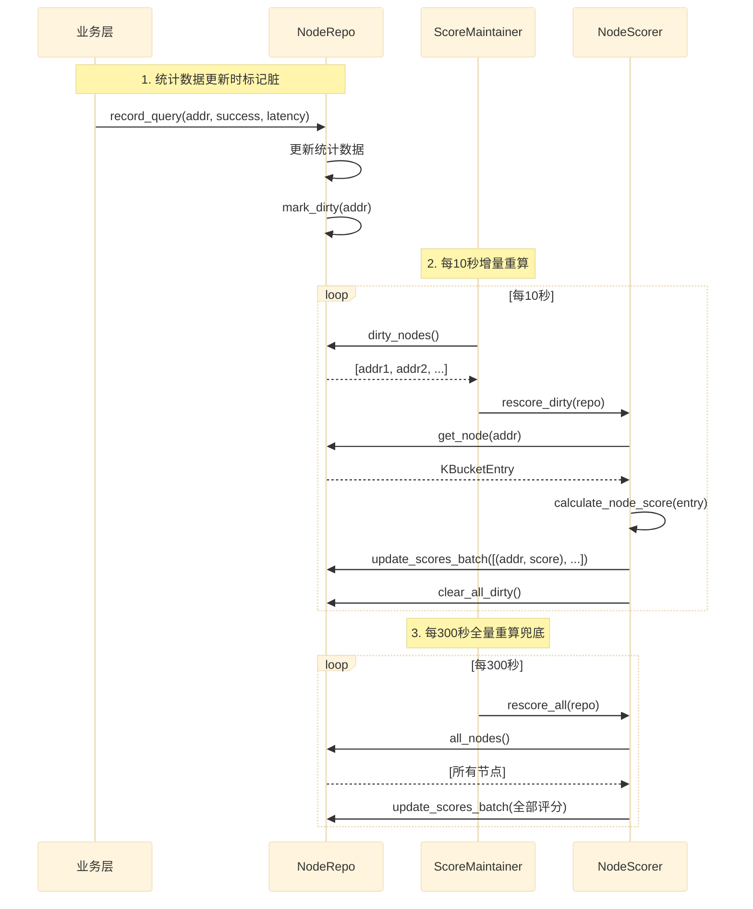
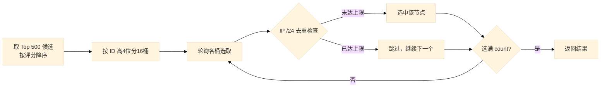

# 03 — 智能层详细设计 (C4 Level 3)

> Intelligence 层 — 评分系统、冷热分层、节点选择的统一收口

## 设计原则

### 统一收口
所有智能决策（评分、冷热、选择）统一在 intelligence 层：
- **数据层 (Repo)**：只负责数据存储和查询，不做智能判断
- **业务层 (Services)**：只负责业务逻辑，通过 intelligence 层获取评分和冷热判断
- **智能层 (Intelligence)**：唯一的智能决策入口

### 增量优先
评分重算、数据持久化等操作优先采用增量方式，避免全量操作带来的性能问题。

### 可观测性
关键操作都有统计和日志，支持监控和问题定位。

### 评分唯一性（根本性原则）
**所有涉及到评分的只允许 ScoreMaintainer 算分，其他任何在评分系统以外的都不具备算分的权限。**

- **个体评分**（节点/Tracker/Peer 的 score）：由 ScoreMaintainer 统一维护，存储在 Repo 中，其他地方只能读取，不能计算
- **整体维度**（健康度、丰富度、覆盖度等）：在个体评分之上做加权聚合，可以包含非评分维度（如数量、覆盖度）
- **决策依据**：所有涉及评分的决策（如爬虫选节点、Tracker 选 tracker）必须以 ScoreMaintainer 维护的评分为准

## 子系统划分



## ScoreSystem 评分系统

### 架构



### 评分维度

#### NodeScorer — DHT 节点评分（4维度加权）

| 维度 | 权重 | 说明 |
|---|---|---|
| 响应率 | 40% | success_count / query_count |
| 延迟 | 20% | 平均响应时间，越快越高 |
| 节点产出 | 25% | 每次查询平均返回的节点数 |
| 在线率 | 15% | 基于连续失败次数 |

**特殊规则**：
- Bad 状态直接 0 分
- Questionable 状态惩罚：评分 × 0.7
- 时间衰减：最后查询超过 24 小时，评分按时间衰减（最低 0.5）

#### PeerScorer — BT Peer 评分（5维度加权）

| 维度 | 权重 | 说明 |
|---|---|---|
| 来源可信度 | 30% | Tracker > SuperTracker > LPD > WebSeed > DHT > PEX > Manual |
| TCP 可达性 | 30% | connection_successes / connection_attempts |
| DHT 支持 | 20% | 是否支持 DHT 协议 |
| 存活时间 | 10% | first_seen 到现在的时间 |
| 多 infohash 共享 | 10% | 出现在多少个 infohash 下 |

#### TrackerScorer — Tracker 评分（4维度加权）

| 维度 | 权重 | 说明 |
|---|---|---|
| 成功率 | 40% | success_requests / total_requests |
| 响应速度 | 20% | 平均响应时间 |
| Peer 产出 | 25% | 每次请求平均发现的 Peer 数 |
| 在线率 | 15% | 基于连续失败次数 |

**特殊规则**：disabled 直接 0 分

### 增量评分机制

#### 脏标记 (Dirty Flag)

```rust
// NodeRepository trait 新增方法
async fn mark_dirty(&self, addr: &SocketAddr);
async fn dirty_nodes(&self) -> Vec<SocketAddr>;
async fn clear_dirty(&self, addr: &SocketAddr);
async fn clear_all_dirty(&self);
```

**触发脏标记的时机**：
- `record_query()` — 节点查询统计更新
- `record_query_with_nodes()` — 节点查询+产出统计更新
- `set_node_state()` — 节点状态变化

#### 批量更新

```rust
// NodeRepository trait 新增方法
async fn update_scores_batch(&self, scores: &[(SocketAddr, f64)]);
```

**优势**：
- 一次写锁，避免 60000 次锁竞争
- 一次事务，避免 60000 次 SQLite UPDATE
- 性能提升：从 O(n) 次锁+事务 → O(1) 次锁+事务

### 可配置权重

```rust
pub struct ScorerConfig {
    pub node: NodeScoreConfig,
    pub peer: PeerScoreConfig,
    pub tracker: TrackerScoreConfig,
}

pub struct NodeScoreConfig {
    pub response_rate_weight: f64,    // 默认 40.0
    pub latency_weight: f64,           // 默认 20.0
    pub nodes_output_weight: f64,      // 默认 25.0
    pub uptime_weight: f64,            // 默认 15.0
    pub questionable_penalty: f64,     // 默认 0.7
    pub decay_start_hours: f64,        // 默认 24.0
    pub decay_end_hours: f64,          // 默认 168.0
    pub decay_min_factor: f64,         // 默认 0.5
}
```

**使用方式**：
```rust
let scorer = NodeScorerImpl::with_config(NodeScoreConfig {
    response_rate_weight: 50.0,
    ..Default::default()
});
```

## TierSystem 冷热分层

### 多维度判定

| 维度 | 权重 | 说明 |
|---|---|---|
| 最后活跃时间 | 40% | 最近活跃的更可能被再次访问 |
| 节点评分 | 30% | 高评分节点更可能被爬虫选择 |
| 访问频率 | 20% | query_count 高的节点更活跃 |
| 数据重要性 | 10% | 预留扩展（如热门 infohash 的 peer） |

### 特殊规则

#### 高评分保底
评分 > 70 的节点，即使暂时不活跃也至少保留为**温数据**，避免优质节点被误降级。

#### 低评分加速降级
评分 < 30 的节点，热阈值缩短为 1/3，加速降级以释放内存。

#### 访问频率调整
- 高频访问（>100次）：热阈值延长 1.5 倍
- 低频访问（<5次）：热阈值缩短为 1/2

### 层级定义

| 层级 | 说明 | 存储策略 |
|---|---|---|
| Hot（热） | 最近活跃 + 高评分 + 高频访问 | 内存常驻，优先访问 |
| Warm（温） | 有活跃但频率不高，或高评分但暂时不活跃 | 部分在内存，可从磁盘加载 |
| Cold（冷） | 长时间无活跃，低评分 | 磁盘归档，可从内存清理 |

### TierSystem 接口

```rust
impl TierSystem {
    pub fn classify_node(last_active, score, query_count) -> DataTier;
    pub fn should_persist(last_active, score, query_count) -> bool;
    pub fn should_keep_in_memory(last_active, score, query_count) -> bool;
    pub async fn check_node_repo(repo) -> TierStats;
    pub async fn get_hot_nodes(repo) -> Vec<SocketAddr>;
    pub async fn get_persistable_nodes(repo) -> Vec<SocketAddr>;
}
```

## SelectSystem 节点选择

### 统一选择接口

```rust
impl SelectSystem {
    /// 多样性选择（爬虫用）
    pub fn select_diverse_nodes(repo, count, max_per_subnet) -> Vec<KBucketEntry>;

    /// 按评分选 Top N
    pub fn select_top_nodes(repo, n) -> Vec<KBucketEntry>;

    /// 爬虫候选选择（热节点优先 + 高评分 + 多样性）
    pub fn select_crawl_candidates(repo, count, max_per_subnet) -> Vec<KBucketEntry>;
}
```

### 多样性选择算法



### 性能优化

**之前**：
- 调用 `repo.all_nodes_sync()` 全量克隆 60000+ 节点
- 每次选择都分配 60000+ 个 KBucketEntry 的内存

**现在**：
- 调用 `repo.top_nodes_sync(500)` 只取 Top 500
- 只在最后返回选中节点时克隆
- 内存分配从 60000+ → 500

## HealthScorer 健康度

### 设计思路

健康度是**整体维度**，在个体评分之上做加权聚合。与个体评分的区别：

| 对比项 | 个体评分 | 整体维度（健康度） |
|---|---|---|
| 评分对象 | 单个节点/Tracker/Peer | 整个层/整个系统 |
| 维护者 | ScoreMaintainer（唯一） | HealthScorer（聚合计算） |
| 存储 | 持久化（Repo + SQLite） | 不存储，实时计算 |
| 用途 | 选谁、排谁、过滤谁 | 系统健不健康、告警 |
| 能否被其他地方计算 | ❌ 绝对不行 | ✅ 可以（只是聚合） |

### 三层加权

| 层级 | 权重 | 维度构成 |
|---|---|---|
| Tracker 层 | 40% | 数量丰富度(25%) + 活跃比例(25%) + 平均评分(30%) + 协议多样性(20%) |
| DHT 层 | 30% | 节点丰富度(40%) + 平均评分(60%) |
| Peer 层 | 30% | infohash 覆盖度(40%) + peer 丰富度(40%) + 基础分(20%) |

### 各层详细规则

#### Tracker 层健康度（4维度加权）

| 维度 | 权重 | 计算方式 | 满分条件 |
|---|---|---|---|
| 数量丰富度 | 25% | min(tracker_count / 50, 1) × 100 | ≥50 个 tracker |
| 活跃比例 | 25% | active / total × 100 | 100% 活跃 |
| 平均评分 | 30% | 所有 tracker score 的平均值 | 平均 100 分 |
| 协议多样性 | 20% | HTTP+UDP都有=100，只有一种=50，都没有=0 | 两种协议都覆盖 |

**公式**：`tracker_layer = richness×0.25 + active_ratio×0.25 + avg_score×0.30 + protocol_diversity×0.20`

#### DHT 层健康度（2维度加权）

| 维度 | 权重 | 计算方式 | 满分条件 |
|---|---|---|---|
| 节点丰富度 | 40% | min(node_count / 10000, 1) × 100 | ≥10000 节点 |
| 平均评分 | 60% | 所有节点 score 的平均值 | 平均 100 分 |

**公式**：`dht_layer = richness×0.40 + avg_score×0.60`

#### Peer 层健康度（3维度加权）

| 维度 | 权重 | 计算方式 | 满分条件 |
|---|---|---|---|
| infohash 覆盖度 | 40% | min(ih_count × 2, 100) | ≥50 个 infohash |
| peer 丰富度 | 40% | min(peer_count × 0.2, 100) | ≥500 个 peer |
| 基础分 | 20% | 固定 20 分 | 缓存系统正常运行 |

**公式**：`peer_layer = ih_coverage×0.40 + peer_richness×0.40 + 20`

#### 综合健康度

**公式**：`overall = tracker_layer×0.40 + dht_layer×0.30 + peer_layer×0.30`

**状态判定**：
| 综合分数 | 状态 |
|---|---|
| ≥80 | Healthy（健康） |
| ≥50 | Degraded（降级） |
| <50 | Unhealthy（不健康） |

### 性能优化

**之前**：每次计算调用 `nodes.all_nodes()` 全量克隆 60000+ 节点

**现在**：调用 `nodes.stats()` 遍历引用统计，零克隆

```rust
pub struct NodeStats {
    pub total: usize,
    pub good: usize,
    pub questionable: usize,
    pub bad: usize,
    pub active: usize,
    pub avg_score: f64,
}
```

## 千万级节点应对策略

### 评分系统
- **增量重算**：只重算脏节点，通常 < 1000 个/轮
- **批量更新**：一次事务更新所有评分
- **分片并行**：脏节点可分成多个分片并行计算（未来优化）
- **限流**：每轮最多重算 X 个节点，避免 CPU 占满（未来优化）

### 冷热分层
- **热节点**：< 5000，全量高频重算
- **温节点**：5000-50000，增量重算脏节点
- **冷节点**：> 50000，不重算（评分已稳定）

### 节点选择
- **Top N 候选**：只取评分最高的 500 个作为候选池
- **不全量克隆**：遍历引用，只在最后返回时克隆

## 下一步

- 阅读 [04-data-model.md](04-data-model.md) 了解数据模型
- 阅读 [05-runtime-flow.md](05-runtime-flow.md) 了解运行时流程
