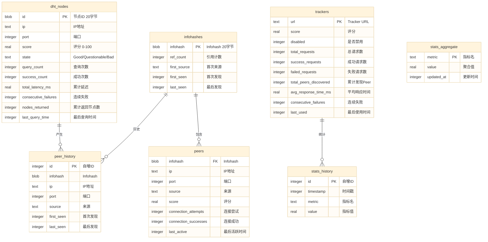
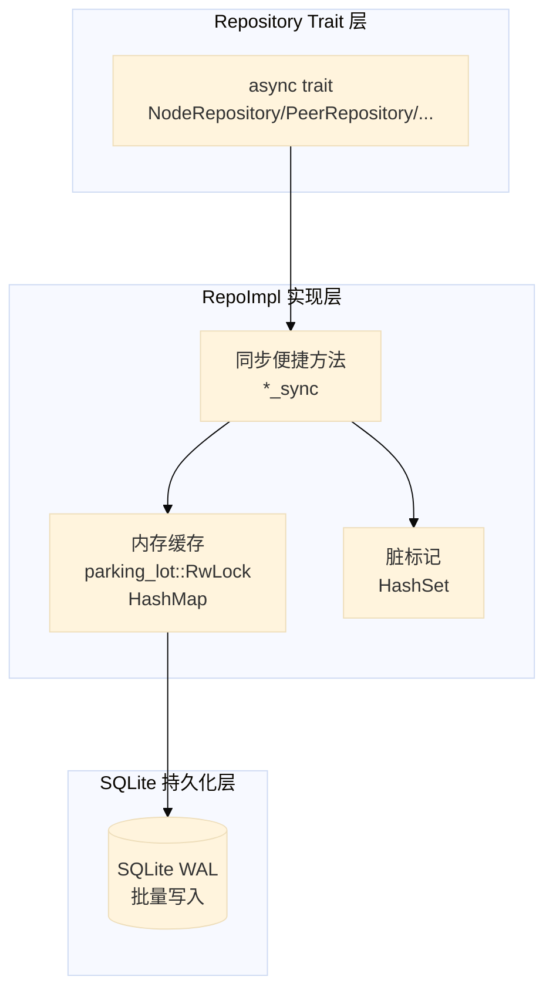

# 04 — 数据模型

> SQLite 表结构、Repo 设计、内存缓存策略

## 数据库总览



## 四大 Repo 设计

### 统一架构



### NodeRepo — DHT 节点归口

**职责**：存储所有 DHT 节点，作为爬虫候选池的唯一归口。

**内存结构**：
```rust
pub struct NodeRepoImpl {
    nodes: RwLock<HashMap<SocketAddr, KBucketEntry>>,
    dirty: RwLock<HashSet<SocketAddr>>,
    storage: Arc<Storage>,
}
```

**关键方法**：
| 方法 | 说明 |
|---|---|
| `add_node_sync(id, addr)` | 添加节点，立即计算初始评分 |
| `record_query_sync(addr, success, latency)` | 记录查询，标记脏 |
| `record_query_with_nodes_sync(addr, latency, nodes)` | 记录查询+产出，标记脏 |
| `stats_sync()` | 节点统计（避免全量克隆） |
| `top_nodes_sync(n)` | Top N 节点（按评分排序） |
| `dirty_nodes_sync()` | 获取脏节点 |
| `update_scores_batch_sync(scores)` | 批量更新评分 |
| `save_all()` | 全量保存到 SQLite |

**数据规模**：60,000+ 节点，目标 1,000,000+

### PeerRepo — BT Peer 归口

**职责**：存储所有 BT Peer，按 infohash 分组，跨 infohash 去重。

**内存结构**：
```rust
struct PeerCache {
    global: HashMap<SocketAddr, PeerInfo>,           // 全局去重
    by_infohash: HashMap<Infohash, HashSet<SocketAddr>>, // 按 infohash 分组
    infohash_refs: HashMap<SocketAddr, HashSet<Infohash>>, // 反向引用
}
```

**关键方法**：
| 方法 | 说明 |
|---|---|
| `add_peer(infohash, peer)` | 添加单个 Peer |
| `add_peers(infohash, peers)` | 批量添加 Peer |
| `get_peers(infohash, limit)` | 获取指定 infohash 的 Peer（按评分排序） |
| `get_peer_infohash_count(addr)` | 获取 Peer 出现在多少个 infohash 下 |
| `update_probe_stats(addr, tcp_ok, supports_dht)` | 更新探测统计 |
| `flush_history()` | 批量写入 peer_history |

**数据规模**：800+ Peer，目标 10,000+

### TrackerRepo — Tracker 归口

**职责**：存储 Tracker 池，统一管理 Tracker 评分和统计。

**内存结构**：
```rust
pub struct TrackerRepoImpl {
    trackers: RwLock<HashMap<String, TrackerEntry>>,
    storage: Arc<Storage>,
}
```

**关键方法**：
| 方法 | 说明 |
|---|---|
| `add_tracker(url)` | 添加 Tracker |
| `record_request(url, success, peers, latency)` | 记录请求统计 |
| `top_trackers(n)` | Top N Tracker（按评分排序） |
| `active_trackers()` | 获取活跃 Tracker（未禁用） |
| `set_disabled(url, disabled)` | 设置禁用状态 |

**数据规模**：79 个 Tracker，目标 200+

### InfohashRepo — Infohash 归口

**职责**：存储所有 infohash，统一引用计数管理。

**内存结构**：
```rust
pub struct InfohashRepoImpl {
    infohashes: RwLock<HashMap<Infohash, InfohashEntry>>,
    storage: Arc<Storage>,
}
```

**关键方法**：
| 方法 | 说明 |
|---|---|
| `register(infohash, source)` | 注册 infohash，引用计数+1 |
| `unregister(infohash)` | 注销 infohash，引用计数-1 |
| `ref_count(infohash)` | 获取引用计数 |
| `cleanup_zero_ref()` | 清理引用计数为 0 的 infohash |

**数据规模**：90+ infohash，目标 1,000+

## 内存缓存策略

### 锁类型
统一使用 `parking_lot::RwLock`，比 `std::sync::RwLock` 性能更好，支持无阻塞读。

### 双写模式
- **内存为主**：所有读写操作先操作内存缓存，延迟极低
- **定期持久化**：每 300 秒全量保存到 SQLite，避免频繁磁盘 IO
- **崩溃恢复**：重启时从 SQLite 加载到内存，最多丢 5 分钟数据

### 避免全量克隆
- `stats_sync()`：遍历引用统计，返回统计结构体，零克隆
- `top_nodes_sync(n)`：只克隆 Top N，不全量克隆
- `dirty_nodes_sync()`：只返回脏节点地址列表

## SQLite 优化

### 配置
```sql
PRAGMA journal_mode=WAL;        -- WAL 模式，读写并发
PRAGMA synchronous=NORMAL;       -- 正常同步，性能优先
PRAGMA wal_autocheckpoint=2000;  -- 2000页自动 checkpoint
PRAGMA temp_store=MEMORY;        -- 临时表存内存
```

### 批量写入
所有 Repo 的 save_all 都使用批量写入：
- 一次事务写入所有记录
- 避免逐条写入的事务开销
- 使用 `spawn_blocking` 避免阻塞 tokio 工作线程

### WAL Checkpoint
- 自动 checkpoint：每 2000 页
- 手动 checkpoint：每 600 秒执行一次 `wal_checkpoint(TRUNCATE)`
- 避免 WAL 文件无限增长

## 数据一致性

### 评分一致性
- 评分系统是唯一维护评分的地方
- 其他模块只更新统计数据，不自行计算评分
- 增量重算（10s）+ 全量重算（300s）双模式保证一致性

### 数据归口一致性
- 四大 Repo 是所有关键数据的唯一归口
- 业务模块通过 trait 访问，不绕过 Repo 直接操作底层
- 所有产生的来源数据全部存入 Repo

## 下一步

- 阅读 [05-runtime-flow.md](05-runtime-flow.md) 了解运行时流程
- 阅读 [../adr/002-intelligence-layer.md](../adr/002-intelligence-layer.md) 了解智能层决策记录
