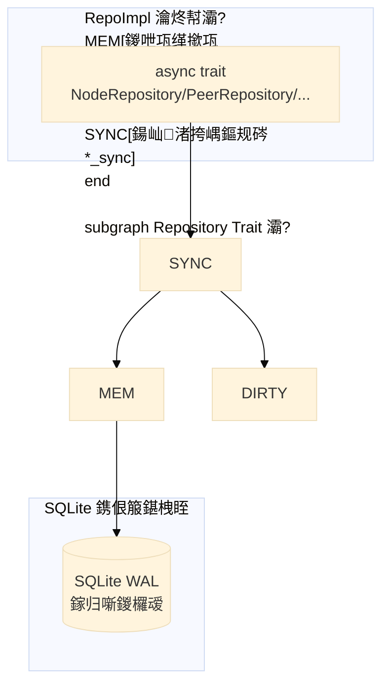

# 04 鈥?鏁版嵁妯″瀷

> SQLite 琛ㄧ粨鏋勩€丷epo 璁捐銆佸唴瀛樼紦瀛樼瓥鐣?

## 鏁版嵁搴撴€昏

```mermaid
%%{init: {'theme':'base', 'themeVariables': {'fontSize':'16px'}, 'flowchart': {'nodeSpacing': 50, 'rankSpacing': 80}, 'sequence': {'actorMargin': 50, 'messageMargin': 20}}}%%
erDiagram
    dht_nodes ||--o{ peer_history : "浜х敓"
    infohashes ||--o{ peers : "鍖呭惈"
    infohashes ||--o{ peer_history : "鍘嗗彶"
    trackers ||--o{ stats_history : "缁熻"

    dht_nodes {
        blob id PK "鑺傜偣ID 20瀛楄妭"
        text ip "IP鍦板潃"
        integer port "绔彛"
        real score "璇勫垎 0-100"
        text state "Good/Questionable/Bad"
        integer query_count "鏌ヨ娆℃暟"
        integer success_count "鎴愬姛娆℃暟"
        real total_latency_ms "绱寤惰繜"
        integer consecutive_failures "杩炵画澶辫触"
        integer nodes_returned "绱杩斿洖鑺傜偣鏁?
        integer last_query_time "鏈€鍚庢煡璇㈡椂闂?
    }

    peers {
        blob infohash FK "Infohash"
        text ip "IP鍦板潃"
        integer port "绔彛"
        text source "鏉ユ簮"
        real score "璇勫垎"
        integer connection_attempts "杩炴帴灏濊瘯"
        integer connection_successes "杩炴帴鎴愬姛"
        integer last_active "鏈€鍚庢椿璺冩椂闂?
    }

    peer_history {
        integer id PK "鑷ID"
        blob infohash "Infohash"
        text ip "IP鍦板潃"
        integer port "绔彛"
        text source "鏉ユ簮"
        integer first_seen "棣栨鍙戠幇"
        integer last_seen "鏈€鍚庡彂鐜?
    }

    trackers {
        text url PK "Tracker URL"
        real score "璇勫垎"
        integer disabled "鏄惁绂佺敤"
        integer total_requests "鎬昏姹傛暟"
        integer success_requests "鎴愬姛璇锋眰鏁?
        integer failed_requests "澶辫触璇锋眰鏁?
        integer total_peers_discovered "绱鍙戠幇Peer"
        real avg_response_time_ms "骞冲潎鍝嶅簲鏃堕棿"
        integer consecutive_failures "杩炵画澶辫触"
        integer last_used "鏈€鍚庝娇鐢ㄦ椂闂?
    }

    infohashes {
        blob infohash PK "Infohash 20瀛楄妭"
        integer ref_count "寮曠敤璁℃暟"
        text first_source "棣栨鏉ユ簮"
        integer first_seen "棣栨鍙戠幇"
        integer last_seen "鏈€鍚庡彂鐜?
    }

    stats_history {
        integer id PK "鑷ID"
        integer timestamp "鏃堕棿鎴?
        text metric "鎸囨爣鍚?
        real value "鎸囨爣鍊?
    }

    stats_aggregate {
        text metric PK "鎸囨爣鍚?
        real value "鑱氬悎鍊?
        integer updated_at "鏇存柊鏃堕棿"
    }
```

## 鍥涘ぇ Repo 璁捐

### 缁熶竴鏋舵瀯



### NodeRepo 鈥?DHT 鑺傜偣褰掑彛

**鑱岃矗**锛氬瓨鍌ㄦ墍鏈?DHT 鑺傜偣锛屼綔涓虹埇铏€欓€夋睜鐨勫敮涓€褰掑彛銆?

**鍐呭瓨缁撴瀯**锛?
```rust
pub struct NodeRepoImpl {
    nodes: RwLock<HashMap<SocketAddr, KBucketEntry>>,
    dirty: RwLock<HashSet<SocketAddr>>,
    storage: Arc<Storage>,
}
```

**鍏抽敭鏂规硶**锛?
| 鏂规硶 | 璇存槑 |
|---|---|
| `add_node_sync(id, addr)` | 娣诲姞鑺傜偣锛岀珛鍗宠绠楀垵濮嬭瘎鍒?|
| `record_query_sync(addr, success, latency)` | 璁板綍鏌ヨ锛屾爣璁拌剰 |
| `record_query_with_nodes_sync(addr, latency, nodes)` | 璁板綍鏌ヨ+浜у嚭锛屾爣璁拌剰 |
| `stats_sync()` | 鑺傜偣缁熻锛堥伩鍏嶅叏閲忓厠闅嗭級 |
| `top_nodes_sync(n)` | Top N 鑺傜偣锛堟寜璇勫垎鎺掑簭锛?|
| `dirty_nodes_sync()` | 鑾峰彇鑴忚妭鐐?|
| `update_scores_batch_sync(scores)` | 鎵归噺鏇存柊璇勫垎 |
| `save_all()` | 鍏ㄩ噺淇濆瓨鍒?SQLite |

**鏁版嵁瑙勬ā**锛?0,000+ 鑺傜偣锛岀洰鏍?1,000,000+

### PeerRepo 鈥?BT Peer 褰掑彛

**鑱岃矗**锛氬瓨鍌ㄦ墍鏈?BT Peer锛屾寜 infohash 鍒嗙粍锛岃法 infohash 鍘婚噸銆?

**鍐呭瓨缁撴瀯**锛?
```rust
struct PeerCache {
    global: HashMap<SocketAddr, PeerInfo>,           // 鍏ㄥ眬鍘婚噸
    by_infohash: HashMap<Infohash, HashSet<SocketAddr>>, // 鎸?infohash 鍒嗙粍
    infohash_refs: HashMap<SocketAddr, HashSet<Infohash>>, // 鍙嶅悜寮曠敤
}
```

**鍏抽敭鏂规硶**锛?
| 鏂规硶 | 璇存槑 |
|---|---|
| `add_peer(infohash, peer)` | 娣诲姞鍗曚釜 Peer |
| `add_peers(infohash, peers)` | 鎵归噺娣诲姞 Peer |
| `get_peers(infohash, limit)` | 鑾峰彇鎸囧畾 infohash 鐨?Peer锛堟寜璇勫垎鎺掑簭锛?|
| `get_peer_infohash_count(addr)` | 鑾峰彇 Peer 鍑虹幇鍦ㄥ灏戜釜 infohash 涓?|
| `update_probe_stats(addr, tcp_ok, supports_dht)` | 鏇存柊鎺㈡祴缁熻 |
| `flush_history()` | 鎵归噺鍐欏叆 peer_history |

**鏁版嵁瑙勬ā**锛?00+ Peer锛岀洰鏍?10,000+

### TrackerRepo 鈥?Tracker 褰掑彛

**鑱岃矗**锛氬瓨鍌?Tracker 姹狅紝缁熶竴绠＄悊 Tracker 璇勫垎鍜岀粺璁°€?

**鍐呭瓨缁撴瀯**锛?
```rust
pub struct TrackerRepoImpl {
    trackers: RwLock<HashMap<String, TrackerEntry>>,
    storage: Arc<Storage>,
}
```

**鍏抽敭鏂规硶**锛?
| 鏂规硶 | 璇存槑 |
|---|---|
| `add_tracker(url)` | 娣诲姞 Tracker |
| `record_request(url, success, peers, latency)` | 璁板綍璇锋眰缁熻 |
| `top_trackers(n)` | Top N Tracker锛堟寜璇勫垎鎺掑簭锛?|
| `active_trackers()` | 鑾峰彇娲昏穬 Tracker锛堟湭绂佺敤锛?|
| `set_disabled(url, disabled)` | 璁剧疆绂佺敤鐘舵€?|

**鏁版嵁瑙勬ā**锛?9 涓?Tracker锛岀洰鏍?200+

### InfohashRepo 鈥?Infohash 褰掑彛

**鑱岃矗**锛氬瓨鍌ㄦ墍鏈?infohash锛岀粺涓€寮曠敤璁℃暟绠＄悊銆?

**鍐呭瓨缁撴瀯**锛?
```rust
pub struct InfohashRepoImpl {
    infohashes: RwLock<HashMap<Infohash, InfohashEntry>>,
    storage: Arc<Storage>,
}
```

**鍏抽敭鏂规硶**锛?
| 鏂规硶 | 璇存槑 |
|---|---|
| `register(infohash, source)` | 娉ㄥ唽 infohash锛屽紩鐢ㄨ鏁?1 |
| `unregister(infohash)` | 娉ㄩ攢 infohash锛屽紩鐢ㄨ鏁?1 |
| `ref_count(infohash)` | 鑾峰彇寮曠敤璁℃暟 |
| `cleanup_zero_ref()` | 娓呯悊寮曠敤璁℃暟涓?0 鐨?infohash |

**鏁版嵁瑙勬ā**锛?0+ infohash锛岀洰鏍?1,000+

## 鍐呭瓨缂撳瓨绛栫暐

### 閿佺被鍨?
缁熶竴浣跨敤 `parking_lot::RwLock`锛屾瘮 `std::sync::RwLock` 鎬ц兘鏇村ソ锛屾敮鎸佹棤闃诲璇汇€?

### 鍙屽啓妯″紡
- **鍐呭瓨涓轰富**锛氭墍鏈夎鍐欐搷浣滃厛鎿嶄綔鍐呭瓨缂撳瓨锛屽欢杩熸瀬浣?
- **瀹氭湡鎸佷箙鍖?*锛氭瘡 300 绉掑叏閲忎繚瀛樺埌 SQLite锛岄伩鍏嶉绻佺鐩?IO
- **宕╂簝鎭㈠**锛氶噸鍚椂浠?SQLite 鍔犺浇鍒板唴瀛橈紝鏈€澶氫涪 5 鍒嗛挓鏁版嵁

### 閬垮厤鍏ㄩ噺鍏嬮殕
- `stats_sync()`锛氶亶鍘嗗紩鐢ㄧ粺璁★紝杩斿洖缁熻缁撴瀯浣擄紝闆跺厠闅?
- `top_nodes_sync(n)`锛氬彧鍏嬮殕 Top N锛屼笉鍏ㄩ噺鍏嬮殕
- `dirty_nodes_sync()`锛氬彧杩斿洖鑴忚妭鐐瑰湴鍧€鍒楄〃

## SQLite 浼樺寲

### 閰嶇疆
```sql
PRAGMA journal_mode=WAL;        -- WAL 妯″紡锛岃鍐欏苟鍙?
PRAGMA synchronous=NORMAL;       -- 姝ｅ父鍚屾锛屾€ц兘浼樺厛
PRAGMA wal_autocheckpoint=2000;  -- 2000椤佃嚜鍔?checkpoint
PRAGMA temp_store=MEMORY;        -- 涓存椂琛ㄥ瓨鍐呭瓨
```

### 鎵归噺鍐欏叆
鎵€鏈?Repo 鐨?save_all 閮戒娇鐢ㄦ壒閲忓啓鍏ワ細
- 涓€娆′簨鍔″啓鍏ユ墍鏈夎褰?
- 閬垮厤閫愭潯鍐欏叆鐨勪簨鍔″紑閿€
- 浣跨敤 `spawn_blocking` 閬垮厤闃诲 tokio 宸ヤ綔绾跨▼

### WAL Checkpoint
- 鑷姩 checkpoint锛氭瘡 2000 椤?
- 鎵嬪姩 checkpoint锛氭瘡 600 绉掓墽琛屼竴娆?`wal_checkpoint(TRUNCATE)`
- 閬垮厤 WAL 鏂囦欢鏃犻檺澧為暱

## 鏁版嵁涓€鑷存€?

### 璇勫垎涓€鑷存€?
- 璇勫垎绯荤粺鏄敮涓€缁存姢璇勫垎鐨勫湴鏂?
- 鍏朵粬妯″潡鍙洿鏂扮粺璁℃暟鎹紝涓嶈嚜琛岃绠楄瘎鍒?
- 澧為噺閲嶇畻锛?0s锛? 鍏ㄩ噺閲嶇畻锛?00s锛夊弻妯″紡淇濊瘉涓€鑷存€?

### 鏁版嵁褰掑彛涓€鑷存€?
- 鍥涘ぇ Repo 鏄墍鏈夊叧閿暟鎹殑鍞竴褰掑彛
- 涓氬姟妯″潡閫氳繃 trait 璁块棶锛屼笉缁曡繃 Repo 鐩存帴鎿嶄綔搴曞眰
- 鎵€鏈変骇鐢熺殑鏉ユ簮鏁版嵁鍏ㄩ儴瀛樺叆 Repo

## 涓嬩竴姝?

- 闃呰 [05-runtime-flow.md](05-runtime-flow.md) 浜嗚В杩愯鏃舵祦绋?
- 闃呰 [../adr/002-intelligence-layer.md](../adr/002-intelligence-layer.md) 浜嗚В鏅鸿兘灞傚喅绛栬褰?
