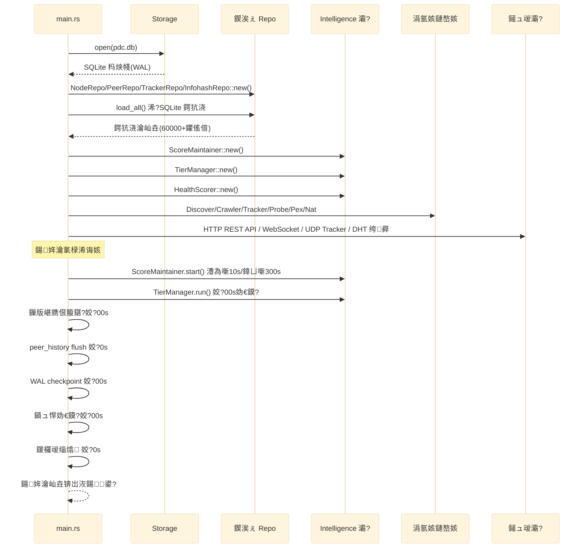
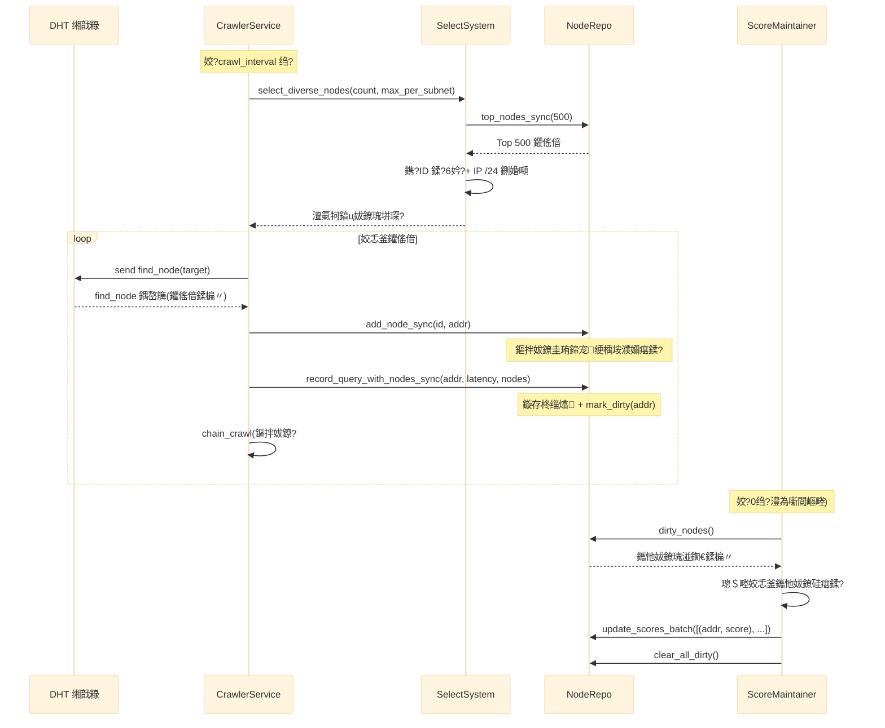
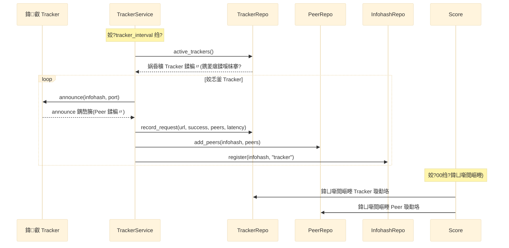
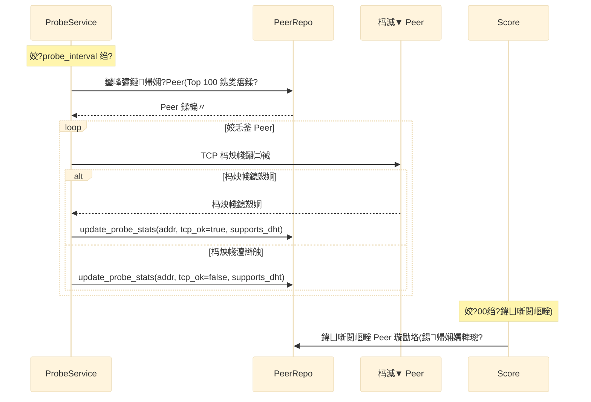
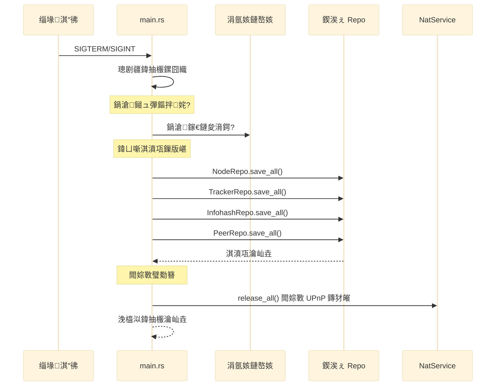

# 05 鈥?杩愯鏃舵祦绋?

> 鍏抽敭涓氬姟鏃跺簭鍥句笌瀹氭椂浠诲姟璋冨害

## 鍚姩娴佺▼

## DHT 鐖櫕娴佺▼

## Tracker 鍙戠幇娴佺▼

## Peer 鎺㈡祴娴佺▼

## 瀹氭椂浠诲姟璋冨害

### 瀹氭椂浠诲姟娓呭崟

| 浠诲姟 | 闂撮殧 | 璇存槑 | 浼樺厛绾?|
|---|---|---|---|
| 璇勫垎澧為噺閲嶇畻 | 10s | ScoreMaintainer 閲嶇畻鑴忚妭鐐?| 楂?|
| 鍐欏叆缁熻杈撳嚭 | 10s | IO 缁熻鏃ュ織 | 浣?|
| peer_history flush | 30s | 鎵归噺鍐欏叆鍘嗗彶璁板綍 | 涓?|
| 璇勫垎鍏ㄩ噺閲嶇畻 | 300s | ScoreMaintainer 鍏滃簳鍏ㄩ噺 | 楂?|
| 鏁版嵁鍏ㄩ噺淇濆瓨 | 300s | 鍥涘ぇ Repo 淇濆瓨鍒?SQLite | 楂?|
| 鍐风儹鍒嗗眰妫€鏌?| 300s | TierManager 娓╁害杩佺Щ | 涓?|
| 鍋ュ悍妫€鏌?| 300s | 绯荤粺鍋ュ悍搴﹁瘎浼?| 涓?|
| WAL checkpoint | 600s | SQLite WAL 鍚堝苟 | 涓?|

### 浠诲姟閿欏紑绛栫暐

涓洪伩鍏嶅涓换鍔″悓鏃剁珵浜夐攣鍜岀鐩?IO锛屼换鍔″惎鍔ㄦ椂闂撮敊寮€锛?
- 璇勫垎澧為噺閲嶇畻锛氱 0 绉掑紑濮?
- 鏁版嵁鍏ㄩ噺淇濆瓨锛氬欢杩?30 绉掑紑濮嬶紙涓庤瘎鍒嗛敊寮€锛?
- 璇勫垎鍏ㄩ噺閲嶇畻锛氬欢杩?300 绉掑紑濮?
- WAL checkpoint锛氬欢杩?300 绉掑紑濮?

## 浼橀泤鍏抽棴娴佺▼

## 鍏抽敭鎬ц兘鎸囨爣

### 璇勫垎绯荤粺
- 澧為噺閲嶇畻寤惰繜锛? 100ms锛堥€氬父 < 1000 涓剰鑺傜偣锛?
- 鍏ㄩ噺閲嶇畻寤惰繜锛? 5s锛?0000 鑺傜偣锛?
- 璇勫垎鏇存柊寤惰繜锛? 10s锛堜粠缁熻鏇存柊鍒拌瘎鍒嗘洿鏂帮級

### 鏁版嵁鎸佷箙鍖?
- 鍏ㄩ噺淇濆瓨寤惰繜锛? 10s锛?0000 鑺傜偣鎵归噺鍐欏叆锛?
- 鏁版嵁涓㈠け绐楀彛锛? 300s锛堟渶澶氫涪 5 鍒嗛挓鏁版嵁锛?
- 纾佺洏 IO锛? 1 MB/s锛堝畾鏈熸壒閲忓啓鍏ワ紝闈炴寔缁級

### 鑺傜偣閫夋嫨
- 澶氭牱鎬ч€夋嫨寤惰繜锛? 50ms锛圱op 500 鍊欓€夋睜锛?
- 鍐呭瓨鍒嗛厤锛?00 涓妭鐐癸紙闈?60000 鍏ㄩ噺锛?

## 涓嬩竴姝?

- 闃呰 [00-overview.md](00-overview.md) 鍥為【鏋舵瀯鎬昏
- 闃呰 [../adr/](../adr/) 浜嗚В鏋舵瀯鍐崇瓥璁板綍
