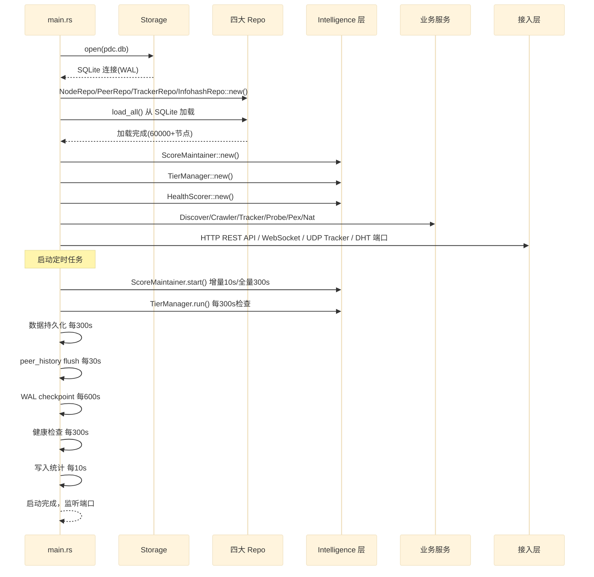
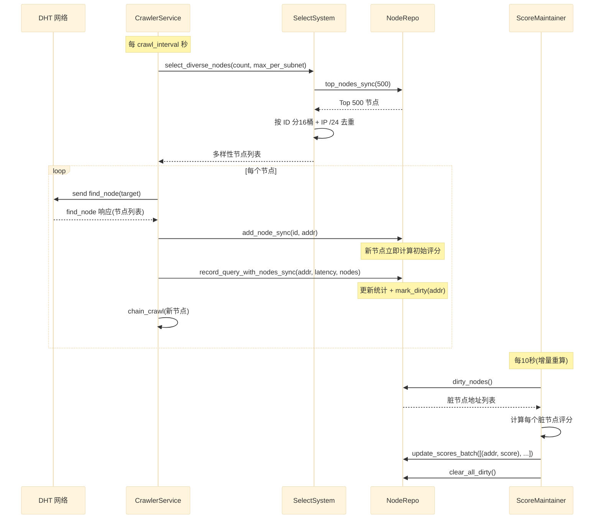
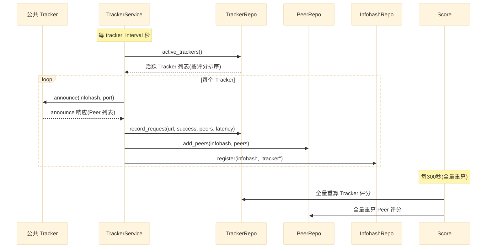
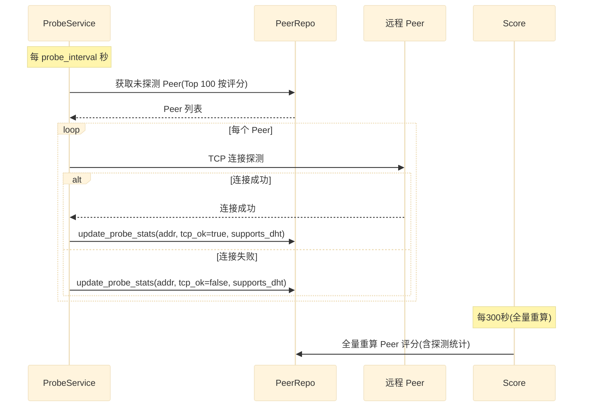
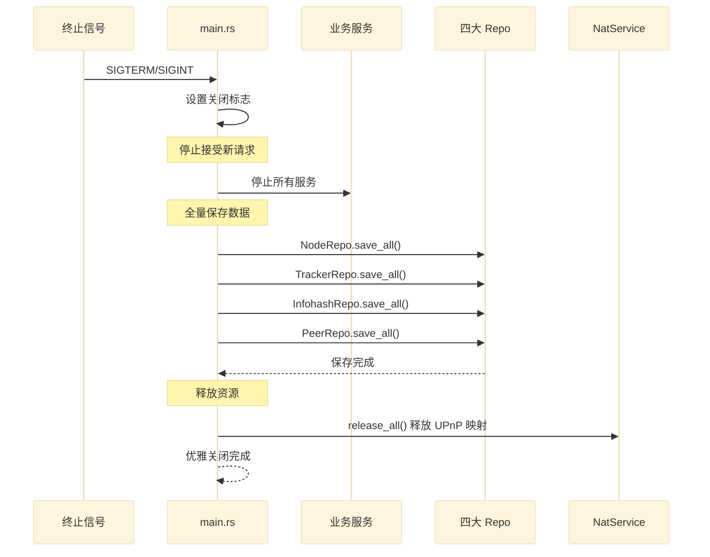

# 05 — 运行时流程

> 关键业务时序图与定时任务调度

## 启动流程

## DHT 爬虫流程

## Tracker 发现流程

## Peer 探测流程

## 定时任务调度

```mermaid
%%{init: {'theme':'base', 'themeVariables': {'fontSize':'16px'}, 'flowchart': {'nodeSpacing': 50, 'rankSpacing': 80}, 'sequence': {'actorMargin': 50, 'messageMargin': 20}}}%%
gantt
    title PDC 定时任务调度
    dateFormat X
    axisFormat %s

    section 评分系统
    增量重算(10s) :active, 0, 10
    增量重算(10s) :active, 10, 20
    增量重算(10s) :active, 20, 30
    全量重算(300s) :crit, 300, 310

    section 数据持久化
    peer_history flush(30s) :active, 0, 30
    peer_history flush(30s) :active, 30, 60
    全量保存(300s) :crit, 300, 310

    section 冷热分层
    温度检查(300s) :crit, 300, 305

    section 存储
    WAL checkpoint(600s) :crit, 600, 610

    section 监控
    健康检查(300s) :crit, 300, 305
    写入统计(10s) :active, 0, 10
```

### 定时任务清单

| 任务 | 间隔 | 说明 | 优先级 |
|---|---|---|---|
| 评分增量重算 | 10s | ScoreMaintainer 重算脏节点 | 高 |
| 写入统计输出 | 10s | IO 统计日志 | 低 |
| peer_history flush | 30s | 批量写入历史记录 | 中 |
| 评分全量重算 | 300s | ScoreMaintainer 兜底全量 | 高 |
| 数据全量保存 | 300s | 四大 Repo 保存到 SQLite | 高 |
| 冷热分层检查 | 300s | TierManager 温度迁移 | 中 |
| 健康检查 | 300s | 系统健康度评估 | 中 |
| WAL checkpoint | 600s | SQLite WAL 合并 | 中 |

### 任务错开策略

为避免多个任务同时竞争锁和磁盘 IO，任务启动时间错开：
- 评分增量重算：第 0 秒开始
- 数据全量保存：延迟 30 秒开始（与评分错开）
- 评分全量重算：延迟 300 秒开始
- WAL checkpoint：延迟 300 秒开始

## 优雅关闭流程

## 关键性能指标

### 评分系统
- 增量重算延迟：< 100ms（通常 < 1000 个脏节点）
- 全量重算延迟：< 5s（60000 节点）
- 评分更新延迟：< 10s（从统计更新到评分更新）

### 数据持久化
- 全量保存延迟：< 10s（60000 节点批量写入）
- 数据丢失窗口：< 300s（最多丢 5 分钟数据）
- 磁盘 IO：< 1 MB/s（定期批量写入，非持续）

### 节点选择
- 多样性选择延迟：< 50ms（Top 500 候选池）
- 内存分配：500 个节点（非 60000 全量）

## 下一步

- 阅读 [00-overview.md](00-overview.md) 回顾架构总览
- 阅读 [../adr/](../adr/) 了解架构决策记录
