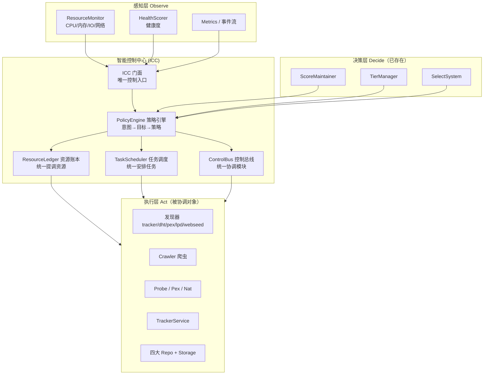

# 08 — 智能控制中心详细设计 (Intelligent Control Center, ICC)

> PDC 智能层的控制中枢（"小脑"）：统一提调所有资源、统一安排所有任务、统一协调各业务模块。
> 决策记录见 [ADR-005](../adr/005-intelligent-control-center.md)

## 1. 一句话定位

ICC 是 PDC **进程内**的自治控制中枢，是智能层「统一收口」原则从**决策收口**（ADR-002 的评分/冷热/选择）向**控制收口**的自然升级：

```
感知全局状态 (Observe) → 统一决策 (Decide) → 统一调度资源/任务/模块 (Act) → 反馈收敛
```

**它不是从零新建**，而是把已有且已分散存在的四块能力整合升级为统一中枢：

| 已有组件 | 现状 | 在 ICC 中的角色 |
|---|---|---|
| `TaskScheduler`（`intelligence/task_scheduler.rs`） | 已实现优先级/令牌桶/错峰/资源感知，但只收编 2 个任务 | 「统一安排任务」的引擎 |
| `ControlPlane`（`control_plane/mod.rs`） | 只协调 5 个发现器 | 「统一协调模块」的雏形，需扩权为 ControlBus |
| `ResourceMonitor`（`task_scheduler.rs` 内） | 只有 CPU/内存读数，无账本 | 「统一提调资源」的感知雏形，需升级为 ResourceLedger |
| `ScoreMaintainer`/`TierManager`/`SelectSystem`/`HealthScorer` | 已「决策收口」 | ICC 的决策供给层 |

## 2. 定位与边界（分层控制）

PDC 生态是分层控制：**大脑 + 小脑 + 脊髓**。

| 层 | 主体 | 定位 | 控制范围 |
|---|---|---|---|
| **大脑** | `pk`（主控台 Agent） | 上层业务主控，跨 Agent 编排 | 编排 pk / pdc / spde 等**多个 Agent**，后期接大模型 |
| **小脑（ICC）** | PDC 进程内 | 节点发现域的自治中枢 | 只协调 **PDC 自己**的资源/任务/业务模块 |
| **脊髓** | 各模块本地 | 无状态执行 | 响应 ICC 指令，执行具体动作 |

**ICC 不做 pk 的事**：pk 下发的是「声明式意图/目标」，ICC 负责把意图分解成内部任务、资源配额、模块指令，并回传执行状态。ICC 不建工作流引擎、不做跨 Agent 编排。

### 边界定稿（三点）

1. **pk ↔ ICC 走 `pnos-sdk`**：组件调用下发意图 + 事件/心跳回传状态。ICC 的 SDK 路由**复用 PDC 现有 6880 HTTP server 挂载**，不自建私有 RPC（详见第 6 节）。
2. **联邦多实例不纳入 ICC 提调**：ResourceLedger/ControlBus 只含单进程内资源；FederationService 仅作为可启停模块纳入生命周期，不做动态预算/提调。
3. **策略引擎纯规则、不接模型**：ICC 的 PolicyEngine 是可配置规则（TOML）；模型决策归 pk（后期接大模型），ICC 输出结构化快照作为大脑输入。

## 3. 总体架构



- **Observe**：ResourceMonitor + HealthScorer + metrics 汇聚成统一「状态快照」。
- **Decide**：已收口的评分/分层/选择 + 新增 PolicyEngine 规则，产出「控制决策」。
- **Act**：ResourceLedger 分配资源、TaskScheduler 排程、ControlBus 下发模块指令。

## 4. 三大「统一」落地

### 4.1 统一提调所有资源 → ResourceLedger（资源账本，新建）

把 `ResourceMonitor` 从"读数器"升级为"记账 + 提调"。**范围仅单进程内**（联邦跨实例资源明确排除）：

```rust
// intelligence/resource_ledger.rs（新建）
pub enum ResourceKind {
    Concurrency, // 爬虫并发 / probe 并发 / tracker 活跃连接
    Bandwidth,   // DHT 出站 / 爬取速率 / 本进程出站中继
    Memory,      // 冷热分层热/温内存预算
    DiskIo,      // 持久化写入预算
}

pub struct ResourceLedger {
    limits: RwLock<ResourceLimits>,                          // 总预算
    usage:  RwLock<ResourceUsage>,                           // 当前总占用
    leases: RwLock<FxHashMap<ResourceId, Lease>>,            // 谁占什么
}

impl ResourceLedger {
    pub async fn acquire(&self, consumer: &str, kind: ResourceKind, amount: u64)
        -> Result<Lease, ResourceExhausted>;                 // 申请配额，超限拒绝或排队
    pub fn release(&self, lease: Lease);
    pub fn set_budget(&self, kind: ResourceKind, limit: u64); // pk 可动态调预算
    pub fn snapshot(&self) -> ResourceSnapshot;               // 供策略引擎/API
}
```

**落点示例**（当前散在各处的配额，收归账本）：

| 现散落配额 | 纳入 ResourceKind |
|---|---|
| 爬虫并发（现 32/64） | Concurrency |
| probe 并发、tracker 活跃连接数 | Concurrency |
| DHT 出站速率、爬取速率 | Bandwidth |
| 冷热分层热/温内存上限（热 <5000 等） | Memory |
| 持久化写入预算 | DiskIo |

> **明确排除**：联邦中继带宽上限（`relay_bandwidth_limit_mbps`）、中继通道数（`relay_max_connections`）等跨实例资源仍由 federation 自管。

### 4.2 统一安排所有任务 → TaskScheduler 全覆盖收编

`TaskScheduler` 引擎已足够完整（优先级 P0–P3、全量任务令牌桶 ≤2、错峰、抖动、资源感知、依赖、重试、统计），缺的是**把散兵收编进来**：

| 现有任务 | 当前方式 | 收编后 |
|---|---|---|
| 增量/全量评分 | `ScoreMaintainer.start()` 内部循环 | 注册为任务（P1 增量 / P2 全量），可被资源感知延迟 |
| 健康检查 | `main.rs` 独立 spawn | 注册为 P0 Critical |
| 冷热分层检查 | TierManager 独立循环 | 注册为 P3 Background |
| 定期持久化 | ✅ 已收编 | 保持 |
| 资源监控 | ✅ 已收编（读数写死） | 保持 + 接入真实 sysinfo |
| NAT/UPnP、联邦心跳、爬虫 tick、probe 扫描 | 各自 `interval()` | 逐步注册，错峰 + 抖动 + 依赖 |

**收益**：`05-runtime-flow.md` 里那张手工错峰表变成 TaskScheduler 的声明式配置，资源紧张时自动让位。

### 4.3 统一协调各业务模块 → ControlBus（ControlPlane 扩权）

把 `ControlPlane` 从"发现器协调器"升级为面向**所有业务模块**的控制总线：

```rust
// control_plane/（扩权）
#[async_trait]
pub trait Controllable {
    fn module_id(&self) -> &'static str;
    async fn start(&self, ctx: &ControlCtx) -> Result<()>;
    async fn stop(&self) -> Result<()>;                            // 优雅暂停
    async fn apply_policy(&self, policy: &ControlPolicy) -> Result<()>; // 下发参数/配额
    async fn snapshot(&self) -> ModuleSnapshot;                    // 状态回传
}

pub struct ControlBus {
    modules: RwLock<FxHashMap<String, Arc<dyn Controllable>>>,
}
```

- 现在 `ControlPlane.register_discoverer()` 只收 `Box<dyn PeerDiscoverer>`；升级后 crawler/probe/pex/nat/tracker 都实现 `Controllable` 并注册到 ControlBus。
- **FederationService 例外**：仅注册为"可启停"模块（`start`/`stop`），不接 `apply_policy` 的资源参数，避免 ICC 越界动跨实例资源。

## 5. 控制闭环（Observe-Decide-Act）

```
┌───────────────────────────────────────────────────────┐
│  OBSERVE  每 5s 汇聚状态快照                             │
│  指标(CPU/内存/IO/网络) + 健康度 + 任务统计 + 模块状态     │
└──────────────────────────┬────────────────────────────┘
                           ▼
┌───────────────────────────────────────────────────────┐
│  DECIDE   PolicyEngine 规则引擎（可配置，不接模型）       │
│  · 资源紧张？→ 提级 Critical、降级 Background             │
│  · 某层健康度 <50？→ 触发补救任务、调爬虫方向              │
│  · 某 infohash 热度高？→ 加 peer 探测配额                  │
│  · 目标偏离（爬虫效率 < 目标）？→ 调并发/选节点策略          │
└──────────────────────────┬────────────────────────────┘
                           ▼
┌───────────────────────────────────────────────────────┐
│  ACT      ICC 三个执行通道                               │
│  ResourceLedger.acquire()  ·  TaskScheduler 排程        │
│  ControlBus.apply_policy()                              │
└──────────────────────────┬────────────────────────────┘
                           ▼
                    （状态变化回流到 OBSERVE，闭环）
```

**策略引擎形态锁定（不接模型）**：

```rust
pub struct PolicyEngine {
    rules: Vec<Rule>,          // 来自 config.control_center，TOML
    ledger: Arc<ResourceLedger>,
    scheduler: Arc<TaskScheduler>,
    bus: Arc<ControlBus>,
}
struct Rule { when: Condition, then: Action }   // 阈值/评分/健康度 → 任务/配额/模块策略
```

规则全部来自 TOML（延续"可配置 + 默认值"约束），**无模型/权重文件**。大模型只存在于 pk 侧（后期），产出的意图经 SDK 进来由规则引擎落地。

## 6. pk ↔ ICC 的 SDK 契约

`pnos-sdk` 关键能力（已核实）：`PnosApp::builder().component_type(Agent).route().on_event()` 组装组件；`app.call(id)` → `ComponentClient`（自带服务发现 + token + 重试）做组件调用；`heartbeat_agent()` 上报负载；`on_event(pattern)` 做事件订阅（前缀匹配）。

**集成方式（已定稿）**：ICC 的 SDK 路由**复用 PDC 现有 6880 HTTP server 挂载**——PDC 用 `PnosApp::builder("pdc").init()` 获取 app，把 ICC 路由通过 `.route()` 挂到现有 axum server，不新开端口、不自建私有 RPC。

### 6.1 方向一：pk → ICC（意图下发 = 组件调用）

```rust
// pk 侧（后期接大模型后，大模型产出的就是这种声明式意图）
let intent = IccIntent {
    kind: IntentKind::Goal,                // Goal / Budget / Policy
    goal: "crawler_efficiency".into(),
    target: 10_000.into(),                 // 节点/小时
    deadline: None,
    params: serde_json::json!({}),
};
app.call("pdc")
    .post("/api/v1/control/intent", &intent)
    .send::<IccIntentAck>()                 // 组件调用：发现 + token + 重试全自动
    .await?;
```

ICC 侧用 `.route("/api/v1/control/intent", post(handle_intent))` 挂到 6880 server，把意图丢给 PolicyEngine 分解。

**意图类型（先定 3 类，全部可被规则引擎求解）**：

| 意图 | 语义 | ICC 内部动作 |
|---|---|---|
| `GoalIntent` 目标类 | "爬虫效率 ≥ N""某 infohash peer 覆盖 ≥ M" | 生成/调整任务、调 SelectSystem 策略、调爬虫并发 |
| `BudgetIntent` 预算类 | 下调带宽/并发/内存总预算 | 写 ResourceLedger.set_budget() |
| `PolicyIntent` 策略类 | 切模式（省电 / 激进 / 均衡） | 热更新 PolicyEngine 规则集 |

### 6.2 方向二：ICC → pk（状态回传 = 三通道）

| 通道 | SDK 能力 | 用途 | 频率 |
|---|---|---|---|
| **心跳负载** | `app.heartbeat_agent(status, load, active_tasks, bytes)` | 负载 / 任务数 / 吞吐 | 心跳周期 |
| **事件订阅** | 发布 `pdc.control.*`，pk `.on_event("pdc.control.*")` | 意图进度、目标偏离、资源耗尽告警 | 事件驱动 |
| **拉取快照** | `app.call("pdc").get("/api/v1/control/status").send::<IccStatus>()` | pk 随时拉全量 ICC 状态（账本+任务+模块+健康度） | 按需 |

> `IccStatus` 就是给 pk 大模型的「结构化决策输入」。**小脑输出快照、大脑产出意图**，两者解耦——pk 接大模型时 ICC 零改动，这是这条边界最大的价值。

## 7. 五条铁律

1. **announce 热路径零侵入**：超级 Tracker 的 `handle_udp_announce` 仍是纯本地内存 <100μs，ICC 只通过后台异步通道间接影响，绝不进同步调用链。
2. **评分唯一性不破**：ICC 只读 ScoreMaintainer 的评分做决策，绝不自行算分（延续 ADR-002）。
3. **可配置 + 默认值**：ICC 所有阈值/权重/预算走 TOML 配置，带 `#[serde(default)]`。
4. **Fail-open 降级**：ICC 或策略引擎失效时，各模块退回自身默认调度自主运行（等同现状），不允许中心坏了全线瘫。
5. **数据层唯一真相源不破**：ICC 只通过 Repo trait 读写，不旁路直连存储。

## 8. 模块改造映射

| 模块 | 改动类型 | 内容 |
|---|---|---|
| `intelligence/resource_ledger.rs` | 新建 | 资源账本：预算/占用/租约 |
| `intelligence/control_center.rs` | 新建 | ICC 门面：聚合账本+调度+总线+策略，暴露 `handle_intent` / `status_snapshot` |
| `intelligence/policy_engine.rs` | 新建 | 规则引擎：`IccIntent → 内部动作` |
| `intelligence/task_scheduler.rs` | 小改 | 收编散落循环、接入真实资源读数 |
| `control_plane/*` | 扩权 | 新增 ControlBus + `Controllable` trait，模块注册/启停/apply_policy（联邦仅启停） |
| `services/*`、`crawler/*` | 改造 | 实现 `Controllable`，散落 `interval()` 注册进 TaskScheduler |
| `main.rs` | 改造 | 用 ICC 门面统一组装；`PnosApp` 接入 pnos-sdk，6880 挂 `/api/v1/control/*` |
| `config.rs` | 小改 | 新增 `[control_center]` 段（规则集、预算默认值） |

## 9. 分阶段实施路线

| 阶段 | 内容 | 验收 |
|---|---|---|
| **P0（骨架）** | 建 `resource_ledger.rs` + `control_center.rs` 门面 + `config` 段，接进 ICC | 单元测试通过，行为不变 |
| **P1（收编任务）** | ScoreMaintainer/健康检查/冷热分层/持久化/NAT 注册进 TaskScheduler，接真实资源读数 | 运行稳定，无回归，指标对齐 |
| **P2（提调资源）** | 爬虫并发/tracker 连接/probe 并发/内存预算纳入账本，支持 pk 调预算 | 资源紧张时自动降级非关键任务可观测 |
| **P3（协调模块 + 对接 pk）** | ControlPlane 扩权为 ControlBus，模块实现 `Controllable`，PolicyEngine 上线，接 pnos-sdk | 目标偏离 → 自动调参 → 状态回流闭环 |

## 10. 风险与权衡

- **过度中心化**：ICC 成为单点 → fail-open 降级 + 无状态策略对冲，ICC 只是决策器不是数据通路。
- **与 pk 职责重叠**：ICC 做跨 Agent 编排就错了 → 边界写死：ICC 只碰 PDC 进程内。
- **收编改造回归**：散循环收进调度器可能引入时序变化 → P1 只收编不改行为，灰度验证。
- **热路径被误伤**：ICC 调用进 announce 链会破坏 <100μs → 架构评审红线 + 性能回归测试。

## 11. 下一步

- 阅读 [ADR-005](../adr/005-intelligent-control-center.md) 了解决策记录与理由
- 阅读 [03-intelligence.md](03-intelligence.md) 了解智能层现有决策子系统
- 阅读 [../adr/002-intelligence-layer.md](../adr/002-intelligence-layer.md) 了解"决策收口"的原始决策（ICC 是它的延伸）
